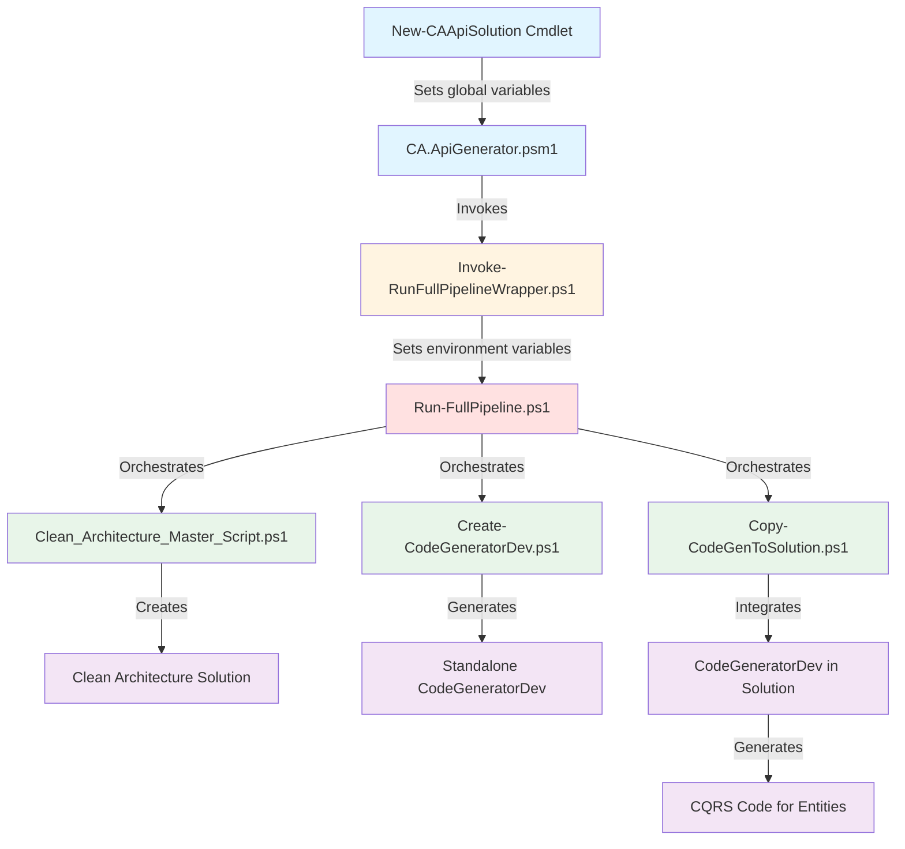
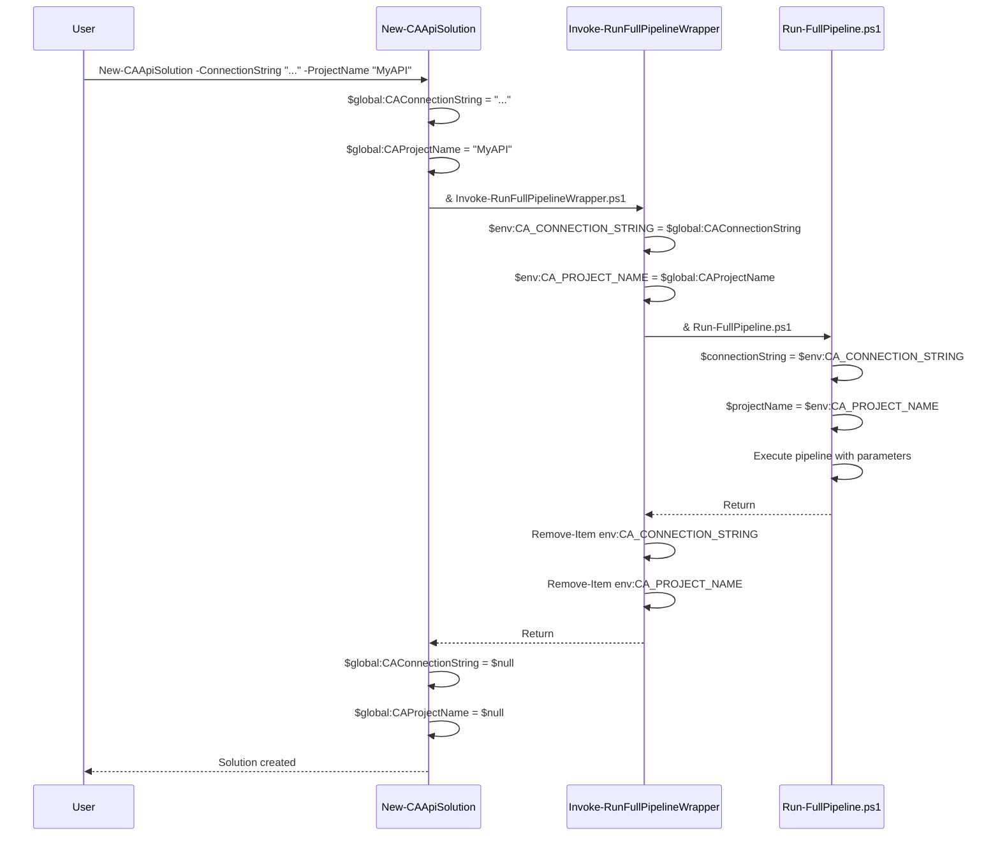
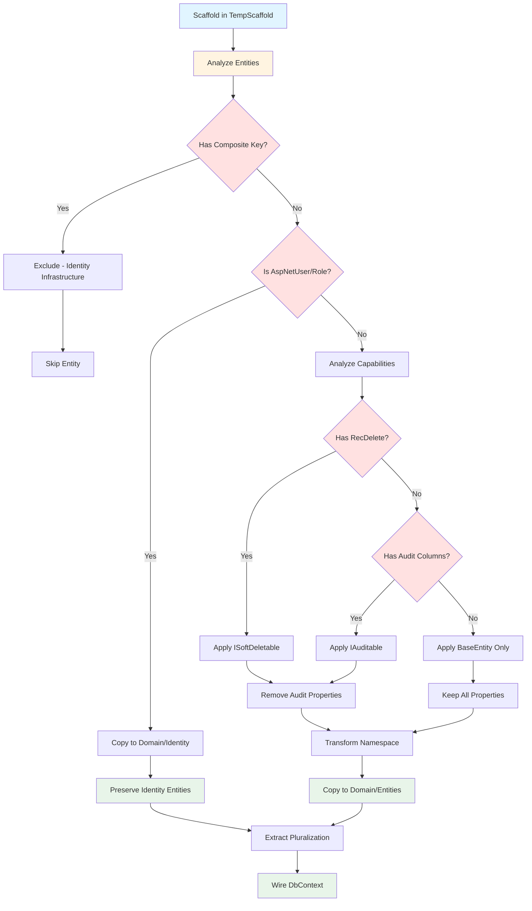
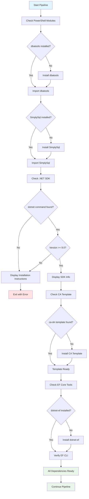

# CA.ApiGenerator - Comprehensive Project Documentation

## Document Metadata

- **Created:** October 25, 2025
- **Last Updated:** October 25, 2025
- **Version:** 1.0.0
- **Based on Code Version:** CA.ApiGenerator v1.0.2
- **Status:** In Progress

## Table of Contents

<!-- Table of contents will be generated here -->

1. [Project Overview](#1-project-overview)
2. [Architecture & Design](#2-architecture--design)
3. [Module Structure](#3-module-structure)
4. [Dependencies](#4-dependencies)
5. [Pipeline Workflow](#5-pipeline-workflow)
6. [Database Support](#6-database-support)
7. [Template Customizations](#7-template-customizations)
8. [Code Generation](#8-code-generation)
9. [Module Interface](#9-module-interface)
10. [Error Handling](#10-error-handling)
11. [Extension Points](#11-extension-points)
12. [Testing & Validation](#12-testing--validation)

---

## 1. Project Overview

### What is CA.ApiGenerator?

CA.ApiGenerator is a PowerShell module that automates the generation of complete Clean Architecture Web API solutions from existing databases. It provides a database-first approach to rapidly scaffold production-ready .NET applications that follow Clean Architecture principles, CQRS patterns, and modern best practices.

The module transforms your existing database schema into a fully functional, maintainable API solution with minimal manual intervention. Simply provide a connection string, and CA.ApiGenerator handles the entire process—from project creation and entity generation to CQRS implementation and API controller scaffolding.

### Key Features

CA.ApiGenerator provides comprehensive automation for Clean Architecture solution generation:

- ✅ **Database-First Generation** - Automatically scaffolds entities, configurations, and DbContext from existing database schemas
- ✅ **CQRS Pattern Implementation** - Generates complete command and query handlers with MediatR integration for all entities
- ✅ **Multi-Database Support** - Works seamlessly with SQL Server, PostgreSQL, and SQLite databases with automatic provider detection
- ✅ **Automatic Dependency Management** - Auto-installs and configures all required dependencies including PowerShell modules, .NET templates, and EF Core tools
- ✅ **Intelligent Code Generation** - Creates vertical slices for each entity including DTOs, validators, API controllers, and integration tests
- ✅ **Capability Detection** - Automatically detects and implements soft delete (ISoftDeletable) and audit trail (IAuditable) patterns based on database schema
- ✅ **Integrated Code Generator** - Embeds a self-contained code generation tool (CodeGeneratorDev) into the solution for future entity additions
- ✅ **Clean Architecture Compliance** - Enforces proper layer separation with Domain, Application, Infrastructure, and Web projects
- ✅ **Interactive and Automated Modes** - Supports both interactive prompts for manual use and fully automated execution for CI/CD pipelines

### Technology Stack

CA.ApiGenerator leverages modern .NET technologies and tools to generate robust API solutions:

| Technology | Version | Purpose |
|------------|---------|---------|
| **PowerShell** | 5.1+ | Module runtime and automation scripting |
| **.NET SDK** | 9.0+ | Target framework for generated solutions |
| **Entity Framework Core** | 9.0 (runtime)<br>7.0.10 (scaffolding) | ORM for database access and entity scaffolding |
| **MediatR** | Latest | CQRS command/query handling |
| **FluentValidation** | Latest | Input validation for commands and queries |
| **AutoMapper** | Latest | Object-to-object mapping for DTOs |
| **Swashbuckle** | Latest | OpenAPI/Swagger documentation |
| **Jason Taylor's CA Template** | Latest (ca-sln) | Base Clean Architecture project structure |
| **dbatools** | Latest | SQL Server database automation |
| **SimplySql** | Latest | Cross-database connectivity (PostgreSQL, SQLite) |

### Relationship to Jason Taylor's Clean Architecture Template

CA.ApiGenerator is built on top of [Jason Taylor's Clean Architecture Solution Template](https://github.com/jasontaylordev/CleanArchitecture) (ca-sln), which provides the foundational project structure and architectural patterns. While the ca-sln template offers an excellent starting point for new Clean Architecture projects with sample code, CA.ApiGenerator extends it with powerful database-first automation capabilities.

**What Jason Taylor's Template Provides:**
- Clean Architecture project structure (Domain, Application, Infrastructure, Web)
- CQRS pattern setup with MediatR
- Sample entities (TodoItem, TodoList) and their implementations
- Authentication and authorization infrastructure
- API endpoint patterns and best practices

**How CA.ApiGenerator Extends It:**
- **Database-First Automation** - Automatically generates entities from existing databases instead of manual creation
- **Complete Code Generation** - Creates full CQRS implementations (commands, queries, validators) for all database entities
- **Template Customization** - Removes sample code and customizes base entities for database-first scenarios
- **Multi-Database Support** - Adds provider detection and configuration for SQL Server, PostgreSQL, and SQLite
- **Intelligent Entity Processing** - Detects and implements soft delete and audit capabilities based on database schema
- **Integrated Code Generator** - Embeds CodeGeneratorDev tool for ongoing entity generation as the database evolves
- **Automated Workflow** - Orchestrates the entire process from dependency checking to running Web project with a single command

In essence, CA.ApiGenerator transforms Jason Taylor's template from a manual starting point into a fully automated database-first solution generator, making it ideal for scenarios where you have an existing database and want to rapidly create a modern, maintainable API layer following Clean Architecture principles.

## 2. Architecture & Design

### Overview

CA.ApiGenerator follows a layered architecture pattern that separates concerns between the public module interface, parameter passing wrappers, orchestration logic, and implementation scripts. This design enables clean separation of responsibilities, maintainability, and flexibility for future enhancements.

The architecture is built around three key principles:

1. **Module Abstraction** - The public PowerShell module provides a clean, user-friendly interface while hiding implementation complexity
2. **Wrapper Pattern** - Intermediate wrapper scripts handle parameter transformation and environment variable communication
3. **Orchestration** - A central orchestrator coordinates the execution of specialized implementation scripts in the correct sequence

### Component Hierarchy

The module is organized in a hierarchical structure with clear responsibilities at each level:



**Layer Descriptions:**

- **Module Layer (Blue)** - Public interface exposed to users via `New-CAApiSolution` cmdlet
- **Wrapper Layer (Yellow)** - Parameter transformation and environment variable management
- **Orchestrator Layer (Red)** - Workflow coordination and script execution sequencing
- **Implementation Layer (Green)** - Specialized scripts that perform specific tasks
- **Output Layer (Purple)** - Generated artifacts and solutions

### Script Orchestration

The module uses a sophisticated orchestration pattern to manage the complex workflow of solution generation. Each script has a specific role in the pipeline:

#### Module Entry Point: CA.ApiGenerator.psm1

The main module file exports the `New-CAApiSolution` cmdlet, which serves as the single entry point for all functionality. It handles:

- Parameter validation and normalization
- Setting global variables for downstream consumption
- Invoking the wrapper script
- Cleanup of global variables after execution

**Key Responsibilities:**
- User-facing API definition
- Parameter acceptance (ConnectionString, ProjectName, Interactive)
- Global variable initialization
- Error handling at the module level

#### Wrapper Scripts

Two wrapper scripts act as intermediaries between the module and implementation scripts:

**Invoke-RunFullPipelineWrapper.ps1**
- Wraps the main pipeline orchestrator
- Converts global variables to environment variables
- Provides isolation between module state and script execution
- Handles cleanup of environment variables

**Invoke-CleanArchitectureWrapper.ps1**
- Wraps the Clean Architecture setup script
- Follows the same pattern as the pipeline wrapper
- Can be invoked independently for CA project creation only

**Why Wrappers?**
The wrapper pattern solves a critical problem: PowerShell scripts cannot directly access global variables from modules. By converting global variables to environment variables, wrappers enable parameter passing without modifying the original implementation scripts.

#### Orchestrator: Run-FullPipeline.ps1

The main orchestrator coordinates the entire solution generation workflow. It:

1. Checks and installs all required dependencies
2. Determines which scripts need to run based on current state
3. Invokes implementation scripts in the correct sequence
4. Manages working directory changes between script executions
5. Handles error conditions and provides user feedback
6. Performs cleanup operations after completion

**Orchestration Logic:**
```powershell
# Check if solution already exists
if (-not $existingSolution) {
    # Step 1: Create Clean Architecture project
    & "$PSScriptRoot\Clean_Architecture_Master_Script.ps1"
    
    # Step 2: Create standalone CodeGeneratorDev
    & "$PSScriptRoot\Create-CodeGeneratorDev.ps1"
}

# Step 3: Copy CodeGeneratorDev into solution
& "$PSScriptRoot\Copy-CodeGenToSolution.ps1"

# Step 4: Run code generation
# (Executes CodeGeneratorDev against Domain.dll)

# Step 5: Start Web project
# (Launches the API in a separate window)
```

#### Implementation Scripts

Three specialized scripts handle specific aspects of solution generation:

**Clean_Architecture_Master_Script.ps1**
- Creates the Clean Architecture project using `dotnet new ca-sln`
- Customizes base entities (BaseAuditableEntity, BaseEntity)
- Removes template sample code (TodoItem, TodoList, etc.)
- Performs isolated database scaffolding
- Integrates scaffolded entities into the Domain project
- Wires DbContext with entity DbSets
- Configures database connection strings
- Builds the Domain project for reflection

**Create-CodeGeneratorDev.ps1**
- Generates a standalone console application for code generation
- Embeds all generator source code (no external dependencies)
- Installs required NuGet packages (MediatR, FluentValidation, etc.)
- Creates generator classes for Models, Queries, Commands, Controllers, Tests
- Implements EntityMetadata pattern for rich entity information
- Implements PluralNameResolver for accurate pluralization from DbContext

**Copy-CodeGenToSolution.ps1**
- Copies the standalone CodeGeneratorDev into the solution's src/ directory
- Adds the project to the solution file
- Updates namespaces to match the solution's naming convention
- Configures Central Package Management compatibility
- Creates launchSettings.json for easy execution

### Parameter Passing Mechanism

CA.ApiGenerator uses a three-tier parameter passing strategy to maintain clean separation between layers while enabling flexible parameter flow:

#### Tier 1: Module Level (Global Variables)

When users invoke `New-CAApiSolution`, parameters are stored as global variables:

```powershell
# In CA.ApiGenerator.psm1
function New-CAApiSolution {
    param(
        [string]$ConnectionString,
        [string]$ProjectName,
        [switch]$Interactive
    )
    
    # Set global variables for wrapper consumption
    if ($ConnectionString) {
        $global:CAConnectionString = $ConnectionString
    }
    
    if ($ProjectName) {
        $global:CAProjectName = $ProjectName
    }
    
    if ($Interactive) {
        $global:CAInteractive = $true
    }
    
    # Invoke wrapper
    & $wrapperScript
    
    # Cleanup
    $global:CAConnectionString = $null
    $global:CAProjectName = $null
    $global:CAInteractive = $null
}
```

**Why Global Variables?**
- Module functions cannot pass parameters directly to external scripts
- Global variables provide a module-scoped state that wrappers can access
- Cleanup ensures no state pollution between invocations

#### Tier 2: Wrapper Level (Environment Variables)

Wrapper scripts convert global variables to environment variables:

```powershell
# In Invoke-RunFullPipelineWrapper.ps1

# Read global variables from module
if ($global:CAConnectionString) {
    $env:CA_CONNECTION_STRING = $global:CAConnectionString
    Write-Host "Using connection string from module" -ForegroundColor Green
}

if ($global:CAProjectName) {
    $env:CA_PROJECT_NAME = $global:CAProjectName
    Write-Host "Using project name from module: $global:CAProjectName" -ForegroundColor Green
}

if ($global:CAInteractive) {
    $env:CA_INTERACTIVE = $global:CAInteractive
}

# Invoke the implementation script
& $ScriptPath

# Cleanup environment variables
Remove-Item env:CA_CONNECTION_STRING -ErrorAction SilentlyContinue
Remove-Item env:CA_PROJECT_NAME -ErrorAction SilentlyContinue
Remove-Item env:CA_INTERACTIVE -ErrorAction SilentlyContinue
```

**Why Environment Variables?**
- Scripts can access environment variables regardless of how they're invoked
- Environment variables cross process boundaries cleanly
- Cleanup prevents environment pollution

#### Tier 3: Script Level (Local Variables)

Implementation scripts check for environment variables and fall back to interactive prompts:

```powershell
# In Clean_Architecture_Master_Script.ps1

# Check for environment variable first (passed from module)
if ($env:CA_CONNECTION_STRING) {
    $connectionString = $env:CA_CONNECTION_STRING
    Write-Host "✓ Using connection string from module" -ForegroundColor Green
} else {
    # Interactive prompt if no environment variable
    $connectionString = Read-Host "Connection String"
    
    if ([string]::IsNullOrWhiteSpace($connectionString)) {
        Write-Host "Error: Connection string cannot be empty." -ForegroundColor Red
        exit
    }
}

# Similar pattern for project name
if (-not [string]::IsNullOrWhiteSpace($env:CA_PROJECT_NAME)) {
    $projectName = $env:CA_PROJECT_NAME
    Write-Host "✓ Using project name from environment: $projectName" -ForegroundColor Green
} else {
    # Auto-generate or prompt for project name
    $projectName = "$cleanDatabaseName" + "_API"
}
```

**Benefits of This Approach:**
- Scripts remain standalone and can be run independently
- Module provides automation while preserving script flexibility
- No modification of original scripts required
- Clear separation of concerns

### Parameter Flow Diagram



### Wrapper Pattern Rationale

The wrapper pattern was introduced to solve several architectural challenges:

#### Problem 1: Module-Script Parameter Passing

PowerShell modules cannot directly pass parameters to external scripts using standard parameter binding. When a module function invokes a script with `& $scriptPath -Param $value`, the script doesn't receive the parameters as expected.

**Solution:** Use global variables within the module scope, then convert them to environment variables in a wrapper script.

#### Problem 2: Script Independence

The original implementation scripts (Clean_Architecture_Master_Script.ps1, etc.) were designed to run standalone with interactive prompts. Modifying them to accept parameters would break their standalone functionality.

**Solution:** Wrappers check for environment variables first, falling back to interactive prompts if not present. This preserves both automated and manual execution modes.

#### Problem 3: State Management

Global variables and environment variables can pollute the execution environment if not properly cleaned up, leading to unexpected behavior in subsequent invocations.

**Solution:** Wrappers implement try-finally blocks to ensure cleanup occurs even if errors happen during execution.

#### Problem 4: Testability

Direct coupling between the module and implementation scripts makes testing difficult and requires complex mocking.

**Solution:** The wrapper layer provides a clear seam for testing. Wrappers can be tested independently, and implementation scripts can be tested with environment variables set directly.

### Isolated Scaffolding Approach

One of the most critical architectural decisions in CA.ApiGenerator is the isolated scaffolding approach for database entity generation.

#### The Challenge

Entity Framework Core's scaffolding command (`dotnet ef dbcontext scaffold`) generates entity classes and a DbContext from an existing database. However, this process has several challenges:

1. **Version Conflicts** - Different EF Core versions produce different scaffolding output
2. **Package Pollution** - Scaffolding requires EF Core design packages that aren't needed at runtime
3. **DbContext Contamination** - The scaffolded DbContext contains configuration we don't want in the final solution
4. **Incremental Updates** - Re-scaffolding overwrites customizations made to entities

#### The Solution: Temporary Staging Project

CA.ApiGenerator creates a temporary, isolated project specifically for scaffolding:

```powershell
# Create temporary staging directory
$tempScaffoldDir = "TempScaffold_$(Get-Date -Format 'yyyyMMdd_HHmmss')"
New-Item -ItemType Directory -Path $tempScaffoldDir -Force

# Create minimal console project
dotnet new console -n TempScaffold -o $tempScaffoldDir

# Install SPECIFIC EF Core version for scaffolding (7.0.10 - known good version)
dotnet add $tempScaffoldDir/TempScaffold.csproj package Microsoft.EntityFrameworkCore.Design --version 7.0.10
dotnet add $tempScaffoldDir/TempScaffold.csproj package Microsoft.EntityFrameworkCore.Tools --version 7.0.10

# Add provider-specific package
if ($databaseProvider -eq "PostgreSQL") {
    dotnet add $tempScaffoldDir/TempScaffold.csproj package Npgsql.EntityFrameworkCore.PostgreSQL --version 7.0.10
}

# Run scaffolding in isolation
dotnet ef dbcontext scaffold "$connectionString" $providerPackage `
    --output-dir Entities `
    --context-dir . `
    --context ApplicationDbContext `
    --force `
    --project $tempScaffoldDir

# Extract entities and pluralization mappings
# Copy entities to Domain project
# Delete temporary directory
Remove-Item -Path $tempScaffoldDir -Recurse -Force
```

#### Benefits of Isolated Scaffolding

**1. Version Control**
- Uses EF Core 7.0.10 specifically for scaffolding (proven stable)
- Main solution uses EF Core 9.0 for runtime
- No version conflicts between scaffolding and runtime packages

**2. Clean Separation**
- Scaffolding packages never touch the main solution
- No design-time dependencies in production code
- Cleaner package references in final solution

**3. Pluralization Extraction**
- Scaffolded DbContext contains accurate pluralization mappings
- Extract DbSet property names (e.g., `DbSet<Doctor> Doctors`)
- Use these mappings for code generation (avoids naive pluralization errors)

**4. Intelligent Entity Processing**
- Analyze scaffolded entities for capability detection
- Apply ISoftDeletable interface if RecDelete column exists
- Apply IAuditable interface if audit columns exist
- Remove audit properties from entity (provided by base class)
- Transform namespaces and clean up using statements

**5. Flexibility**
- Can re-scaffold at any time without affecting main solution
- Easy to experiment with different scaffolding options
- Temporary directory is automatically cleaned up

#### Entity Integration Workflow

After scaffolding in isolation, entities are intelligently integrated into the Domain project:



**Three-Tier Entity Processing:**

**Tier 1: Exclude Identity Infrastructure**
- Entities with composite primary keys (e.g., AspNetUserRoles, AspNetUserClaims)
- These are EF Core Identity framework tables
- Not business entities, so excluded from code generation

**Tier 2: Isolate Identity Entities**
- AspNetUser and AspNetRole entities
- Copied to Domain/Identity namespace
- Preserved for authentication/authorization
- Not included in code generation

**Tier 3: Process Business Entities**
- All other entities are business domain entities
- Capability detection applied
- Audit properties removed if IAuditable detected
- RecDelete property removed if ISoftDeletable detected
- Primary key always preserved
- Copied to Domain/Entities namespace
- Included in code generation

This isolated scaffolding approach ensures clean, maintainable entity integration while preserving the flexibility to re-scaffold as the database evolves.

## 3. Module Structure

### Overview

CA.ApiGenerator follows a clean, organized file structure that separates public interfaces, implementation scripts, and supporting resources. The module is designed for easy navigation, maintenance, and extension.

### File Hierarchy

```
CA.ApiGenerator/
│
├── CA.ApiGenerator.psm1          # Main module file (public interface)
├── CA.ApiGenerator.psd1          # Module manifest (metadata)
├── README.md                     # User-facing documentation
├── DOCUMENTATION.md              # Comprehensive technical documentation
│
├── bin/                          # Implementation scripts directory
│   ├── Run-FullPipeline.ps1                      # Main orchestrator
│   ├── Clean_Architecture_Master_Script.ps1      # CA project setup
│   ├── Create-CodeGeneratorDev.ps1               # Code generator creation
│   ├── Copy-CodeGenToSolution.ps1                # Integration script
│   ├── Invoke-RunFullPipelineWrapper.ps1         # Pipeline wrapper
│   └── Invoke-CleanArchitectureWrapper.ps1       # CA setup wrapper
│
└── images/                       # Documentation images
    └── CA_API_Generator_PowerPoint.png
```

### Root-Level Files

#### CA.ApiGenerator.psm1

**Purpose:** Main module file that defines the public interface

**Key Responsibilities:**
- Exports the `New-CAApiSolution` cmdlet as the primary entry point
- Handles parameter validation and normalization
- Sets global variables for downstream script consumption
- Invokes wrapper scripts to execute the pipeline
- Performs cleanup of global variables after execution
- Provides user-facing error handling and feedback

**Key Functions:**
```powershell
function New-CAApiSolution {
    param(
        [string]$ConnectionString,
        [string]$ProjectName,
        [switch]$Interactive
    )
    # Sets global variables and invokes wrapper
}
```

**Module Exports:**
- `New-CAApiSolution` - The only public cmdlet exposed to users

#### CA.ApiGenerator.psd1

**Purpose:** PowerShell module manifest containing metadata and configuration

**Key Contents:**
- Module version information
- Author and copyright details
- PowerShell version requirements (5.1+)
- Required modules and dependencies
- Functions to export (New-CAApiSolution)
- Module description and tags
- Project URI and license information

**Critical Settings:**
```powershell
@{
    ModuleVersion = '1.0.2'
    PowerShellVersion = '5.1'
    FunctionsToExport = @('New-CAApiSolution')
    # ... additional metadata
}
```

#### README.md

**Purpose:** User-facing documentation for quick start and basic usage

**Key Sections:**
- Installation instructions
- Quick start guide
- Basic usage examples
- Feature overview
- Prerequisites
- Troubleshooting tips
- Links to detailed documentation

**Target Audience:** End users who want to quickly understand and use the module

#### DOCUMENTATION.md

**Purpose:** Comprehensive technical documentation for developers and maintainers

**Key Sections:**
- Complete architecture documentation
- Detailed workflow explanations
- Implementation details
- Customization guides
- Extension points
- Troubleshooting procedures

**Target Audience:** Developers, team members, and LLM assistants who need to understand, maintain, or extend the codebase

### bin/ Directory Scripts

The `bin/` directory contains all implementation scripts organized by responsibility. These scripts are not directly exposed to users but are invoked by the module through wrappers.

#### Run-FullPipeline.ps1

**Type:** Main Orchestrator

**Purpose:** Coordinates the complete solution generation workflow from start to finish

**Key Responsibilities:**
- **Dependency Management** - Checks and auto-installs all required dependencies:
  - PowerShell modules (dbatools, SimplySql)
  - .NET SDK 9.0+ validation
  - Clean Architecture template installation
  - EF Core tools (dotnet-ef global tool)
- **Workflow Orchestration** - Executes scripts in the correct sequence:
  1. Invoke Clean_Architecture_Master_Script.ps1 (if new solution)
  2. Invoke Create-CodeGeneratorDev.ps1 (if not exists)
  3. Invoke Copy-CodeGenToSolution.ps1 (integration)
  4. Execute code generation via CodeGeneratorDev
  5. Start Web project with Swagger UI
- **State Management** - Determines which steps to run based on existing artifacts
- **Error Handling** - Provides detailed error messages and troubleshooting guidance
- **Cleanup** - Removes temporary files and directories after completion

**Parameter Sources:**
- Environment variables (set by wrapper): `$env:CA_CONNECTION_STRING`, `$env:CA_PROJECT_NAME`
- Interactive prompts (fallback if environment variables not set)

**Execution Flow:**
```powershell
# Step 0: Check dependencies
# Step 1: Create CA project (if needed)
& "$PSScriptRoot\Clean_Architecture_Master_Script.ps1"

# Step 2: Create standalone CodeGeneratorDev (if needed)
& "$PSScriptRoot\Create-CodeGeneratorDev.ps1"

# Step 3: Copy CodeGeneratorDev into solution
& "$PSScriptRoot\Copy-CodeGenToSolution.ps1"

# Step 4: Run code generation
# Step 5: Start Web project
# Step 6: Cleanup
```

**Output:**
- Complete Clean Architecture solution
- Integrated CodeGeneratorDev project
- Generated CQRS code for all entities
- Running Web project with Swagger UI

#### Clean_Architecture_Master_Script.ps1

**Type:** Implementation Script

**Purpose:** Creates and customizes the Clean Architecture project from Jason Taylor's template

**Key Responsibilities:**
- **Tool Verification** - Validates .NET CLI installation and version
- **Template Management** - Verifies/installs Clean.Architecture.Solution.Template
- **Database Connection** - Handles connection string input and validation
- **Provider Detection** - Auto-detects database provider (SQL Server, PostgreSQL, SQLite)
- **Project Creation** - Executes `dotnet new ca-sln` with appropriate provider
- **Base Entity Customization** - Modifies BaseAuditableEntity and BaseEntity:
  - DateTimeOffset → DateTime conversion
  - Nullable LastModified property
  - RecDelete property addition for soft deletes
  - Commented Id property in BaseEntity
- **Template Cleaning** - Removes all sample code:
  - TodoItem/TodoList entities and events
  - Todo CQRS handlers and folders
  - Todo configurations and seed data
  - Todo API endpoints and tests
- **Infrastructure Setup** - Creates exception and mapping infrastructure:
  - NotFoundException.cs
  - IMapFrom<T> interface
  - MappingProfile with reflection
  - ApiControllerBase with MediatR integration
- **Database Scaffolding** - Performs isolated entity scaffolding:
  - Creates temporary staging project
  - Installs EF Core 7.0.10 for scaffolding
  - Executes `dotnet ef dbcontext scaffold`
  - Extracts entities and pluralization mappings
- **Entity Integration** - Intelligently processes scaffolded entities:
  - Excludes Identity infrastructure tables
  - Isolates AspNetUser/AspNetRole
  - Detects and applies ISoftDeletable/IAuditable interfaces
  - Removes audit properties (provided by base class)
  - Transforms namespaces
- **DbContext Wiring** - Adds DbSet declarations to IApplicationDbContext and ApplicationDbContext
- **NSwag Removal** - Replaces NSwag with Swashbuckle for VS2022 compatibility
- **Project Build** - Compiles Domain project for reflection-based code generation

**Parameter Sources:**
- Environment variables: `$env:CA_CONNECTION_STRING`, `$env:CA_PROJECT_NAME`
- Interactive prompts with examples (fallback)

**Output:**
- Clean Architecture solution with customized base entities
- Scaffolded and integrated domain entities
- Configured database connection
- Built Domain.dll ready for code generation

#### Create-CodeGeneratorDev.ps1

**Type:** Implementation Script

**Purpose:** Generates a standalone, self-contained code generation console application

**Key Responsibilities:**
- **Project Creation** - Creates a new console application structure
- **Package Installation** - Installs required NuGet packages:
  - Microsoft.EntityFrameworkCore
  - Microsoft.Extensions.DependencyInjection
  - MediatR
  - FluentValidation
  - AutoMapper
- **Source Embedding** - Embeds all generator source code directly in the project:
  - EntityMetadata.cs (rich entity information pattern)
  - PluralNameResolver.cs (accurate pluralization from DbContext)
  - ModelGenerator.cs (DTO generation)
  - GetQueryGenerator.cs (single entity retrieval)
  - GetAllQueryGenerator.cs (list retrieval)
  - UpsertCommandGenerator.cs (create/update)
  - DeleteCommandGenerator.cs (soft delete support)
  - Validator generators
  - ConfigurationGenerator.cs (EF Core configuration)
  - ControllerGenerator.cs (API endpoints)
  - TestTemplateGenerator.cs (integration tests)
- **Program.cs Setup** - Configures the main entry point:
  - Domain.dll loading via reflection
  - Entity discovery and filtering
  - Metadata building with capability detection
  - Generator execution for all entities
- **Build Execution** - Compiles the standalone project

**Parameters:**
- `$OutputPath` - Where to create the project (default: `.\CodeGeneratorDev`)
- `$SkipBuild` - Skip compilation (for testing)

**Output:**
- Standalone CodeGeneratorDev console application
- All generator source code embedded (no external dependencies)
- Ready to be copied into any CA solution

**Design Philosophy:**
The standalone approach allows CodeGeneratorDev to be created once and reused across multiple projects without modification. It's completely self-contained with all source code embedded.

#### Copy-CodeGenToSolution.ps1

**Type:** Integration Script

**Purpose:** Copies the standalone CodeGeneratorDev into an existing Clean Architecture solution

**Key Responsibilities:**
- **Auto-Detection** - Finds CodeGeneratorDev source and target solution automatically
- **Project Copy** - Copies CodeGeneratorDev to solution's `src/` directory
- **Solution Integration** - Adds project to .sln file using `dotnet sln add`
- **Namespace Updates** - Transforms namespaces to match solution naming:
  - `CodeGeneratorDev` → `{SolutionName}.CodeGeneratorDev`
- **Central Package Management** - Adapts project for CPM compatibility:
  - Removes version attributes from PackageReference elements
  - Ensures compatibility with Directory.Packages.props
- **Configuration** - Creates launchSettings.json for easy execution
- **Nullable Annotations** - Configures nullable reference type handling
- **Project References** - Adds reference to Domain project for entity access

**Parameters:**
- `$TargetSolutionPath` - Path to target solution (auto-detected if not provided)
- `$CodeGenSourcePath` - Path to standalone CodeGeneratorDev (auto-detected if not provided)

**Auto-Detection Logic:**
```powershell
# Find CodeGeneratorDev source
if (Test-Path "CodeGeneratorDev\CodeGeneratorDev\CodeGeneratorDev.csproj") {
    $CodeGenSourcePath = "CodeGeneratorDev"
}

# Find target solution
$solutions = Get-ChildItem -Filter "*.sln" | Where-Object { $_.Directory.Name -ne "CodeGeneratorDev" }
if ($solutions.Count -eq 1) {
    $TargetSolutionPath = $solutions[0].Directory.FullName
}
```

**Output:**
- CodeGeneratorDev integrated into solution
- Namespaces aligned with solution naming
- Ready to execute against Domain.dll

#### Invoke-RunFullPipelineWrapper.ps1

**Type:** Parameter Wrapper

**Purpose:** Bridges the module and Run-FullPipeline.ps1 by converting global variables to environment variables

**Key Responsibilities:**
- **Parameter Transformation** - Converts module global variables to environment variables:
  - `$global:CAConnectionString` → `$env:CA_CONNECTION_STRING`
  - `$global:CAProjectName` → `$env:CA_PROJECT_NAME`
  - `$global:CAInteractive` → `$env:CA_INTERACTIVE`
- **Script Invocation** - Executes Run-FullPipeline.ps1 unchanged
- **Cleanup** - Removes environment variables after execution

**Why This Exists:**
PowerShell modules cannot directly pass parameters to external scripts. This wrapper solves that problem by using environment variables as a communication mechanism.

**Code Structure:**
```powershell
# Read global variables from module
if ($global:CAConnectionString) {
    $env:CA_CONNECTION_STRING = $global:CAConnectionString
}

# Invoke the original script
& $ScriptPath

# Cleanup
Remove-Item env:CA_CONNECTION_STRING -ErrorAction SilentlyContinue
```

**Benefits:**
- Original script remains standalone and can be run independently
- Module provides automation without modifying implementation scripts
- Clean separation of concerns

#### Invoke-CleanArchitectureWrapper.ps1

**Type:** Parameter Wrapper

**Purpose:** Bridges the module and Clean_Architecture_Master_Script.ps1 using the same wrapper pattern

**Key Responsibilities:**
- **Parameter Transformation** - Converts module global variables to environment variables:
  - `$global:CAConnectionString` → `$env:CA_CONNECTION_STRING`
  - `$global:CAProjectName` → `$env:CA_PROJECT_NAME`
- **Script Invocation** - Executes Clean_Architecture_Master_Script.ps1 unchanged
- **Cleanup** - Removes environment variables after execution

**Use Case:**
Allows the Clean Architecture setup to be invoked independently from the full pipeline, useful for testing or partial automation scenarios.

**Code Structure:**
```powershell
# Read global variables from module
if ($global:CAConnectionString) {
    $env:CA_CONNECTION_STRING = $global:CAConnectionString
}

# Invoke the original script
& $ScriptPath

# Cleanup
Remove-Item env:CA_CONNECTION_STRING -ErrorAction SilentlyContinue
```

### Script Relationships

The following table summarizes the purpose and relationships of all bin/ scripts:

| Script | Type | Purpose | Invoked By | Invokes |
|--------|------|---------|------------|---------|
| **Run-FullPipeline.ps1** | Orchestrator | Coordinates complete workflow | Invoke-RunFullPipelineWrapper.ps1 | Clean_Architecture_Master_Script.ps1<br>Create-CodeGeneratorDev.ps1<br>Copy-CodeGenToSolution.ps1 |
| **Clean_Architecture_Master_Script.ps1** | Implementation | Creates and customizes CA project | Run-FullPipeline.ps1<br>Invoke-CleanArchitectureWrapper.ps1 | dotnet CLI commands<br>EF Core scaffolding |
| **Create-CodeGeneratorDev.ps1** | Implementation | Generates standalone code generator | Run-FullPipeline.ps1 | dotnet CLI commands |
| **Copy-CodeGenToSolution.ps1** | Implementation | Integrates CodeGeneratorDev into solution | Run-FullPipeline.ps1 | dotnet CLI commands |
| **Invoke-RunFullPipelineWrapper.ps1** | Wrapper | Passes parameters to Run-FullPipeline.ps1 | CA.ApiGenerator.psm1 | Run-FullPipeline.ps1 |
| **Invoke-CleanArchitectureWrapper.ps1** | Wrapper | Passes parameters to Clean_Architecture_Master_Script.ps1 | CA.ApiGenerator.psm1 (optional) | Clean_Architecture_Master_Script.ps1 |

### Execution Flow Diagram

```mermaid
flowchart TD
    A[User: New-CAApiSolution] --> B[CA.ApiGenerator.psm1]
    B -->|Sets $global:CA*| C[Invoke-RunFullPipelineWrapper.ps1]
    C -->|Sets $env:CA_*| D[Run-FullPipeline.ps1]
    
    D -->|Step 0| E[Check Dependencies]
    E --> F{Solution Exists?}
    
    F -->|No| G[Clean_Architecture_Master_Script.ps1]
    G --> H[Create CA Project]
    H --> I[Customize Base Entities]
    I --> J[Scaffold Database]
    J --> K[Integrate Entities]
    K --> L[Wire DbContext]
    L --> M[Build Domain.dll]
    
    F -->|Yes| N{CodeGeneratorDev Exists?}
    M --> N
    
    N -->|No| O[Create-CodeGeneratorDev.ps1]
    O --> P[Generate Standalone Project]
    P --> Q[Embed Generator Source]
    Q --> R[Build CodeGeneratorDev]
    
    N -->|Yes| S[Copy-CodeGenToSolution.ps1]
    R --> S
    
    S --> T[Copy to src/]
    T --> U[Update Namespaces]
    U --> V[Add to Solution]
    V --> W[Configure CPM]
    
    W --> X[Execute Code Generation]
    X --> Y[Generate CQRS Code]
    Y --> Z[Start Web Project]
    Z --> AA[Open Swagger UI]
    
    style A fill:#e1f5ff
    style B fill:#e1f5ff
    style C fill:#fff4e1
    style D fill:#ffe1e1
    style G fill:#e8f5e9
    style O fill:#e8f5e9
    style S fill:#e8f5e9
    style AA fill:#f3e5f5
```



### Generated Solution Structure

When CA.ApiGenerator completes, it produces a Clean Architecture solution with the following structure:

```
{ProjectName}/
│
├── {ProjectName}.sln                 # Solution file
│
├── src/
│   ├── Domain/                       # Domain layer (entities, interfaces)
│   │   ├── Entities/                 # Business entities from database
│   │   ├── Identity/                 # AspNetUser, AspNetRole
│   │   ├── Common/                   # BaseEntity, BaseAuditableEntity
│   │   └── Domain.csproj
│   │
│   ├── Application/                  # Application layer (CQRS, DTOs)
│   │   ├── Common/                   # Interfaces, behaviors, mappings
│   │   ├── {EntityPlural}/           # Per-entity folders
│   │   │   ├── Models/               # DTOs with AutoMapper
│   │   │   ├── Queries/              # Get, GetAll queries
│   │   │   └── Commands/             # Upsert, Delete commands
│   │   └── Application.csproj
│   │
│   ├── Infrastructure/               # Infrastructure layer (EF Core, services)
│   │   ├── Data/
│   │   │   ├── ApplicationDbContext.cs
│   │   │   ├── Configurations/       # EF Core entity configurations
│   │   │   └── Interceptors/         # Audit interceptor
│   │   └── Infrastructure.csproj
│   │
│   ├── Web/                          # Presentation layer (API)
│   │   ├── Controllers/              # API controllers per entity
│   │   ├── Infrastructure/           # ApiControllerBase
│   │   ├── appsettings.json          # Configuration
│   │   └── Web.csproj
│   │
│   └── CodeGeneratorDev/             # Code generation tool
│       ├── Generators/               # Generator classes
│       ├── EntityMetadata.cs         # Entity information pattern
│       ├── PluralNameResolver.cs     # Pluralization logic
│       └── CodeGeneratorDev.csproj
│
└── tests/
    └── Application.FunctionalTests/  # Integration tests per entity
        └── Application.FunctionalTests.csproj
```

### Design Rationale

#### Why Separate bin/ Directory?

**Benefits:**
- **Clean Module Interface** - Users only see the module file and manifest
- **Implementation Hiding** - Internal scripts are not exposed to users
- **Organization** - All implementation scripts in one location
- **Maintainability** - Easy to locate and modify specific functionality

#### Why Wrapper Scripts?

**Problem:** PowerShell modules cannot directly pass parameters to external scripts

**Solution:** Wrappers convert global variables to environment variables

**Benefits:**
- Original scripts remain standalone and testable
- Module provides automation without modifying implementation
- Clear separation between public interface and implementation
- Scripts can be run manually or via module

#### Why Standalone CodeGeneratorDev?

**Benefits:**
- **Reusability** - Create once, use in multiple projects
- **No External Dependencies** - All source code embedded
- **Easy Distribution** - Single project that can be copied anywhere
- **Flexibility** - Can be customized per solution after integration

#### Why Orchestrator Pattern?

**Benefits:**
- **Single Responsibility** - Each script has one clear purpose
- **Testability** - Scripts can be tested independently
- **Flexibility** - Easy to add new steps or modify workflow
- **Error Handling** - Centralized error management in orchestrator
- **State Management** - Orchestrator determines which steps to run

## 4. Dependencies

### Overview

CA.ApiGenerator requires several dependencies to function correctly. The module is designed with intelligent dependency management that automatically checks for and installs most required components. This section documents all dependencies, their purposes, version requirements, and the automatic installation process.

Dependencies are categorized into two groups:
- **Manual Prerequisites** - Must be installed by the user before running the module
- **Auto-Installed Dependencies** - Automatically installed by the module during first run

### Manual Prerequisites

The following dependencies must be manually installed before using CA.ApiGenerator. The module will check for these and provide installation guidance if they're missing.

| Dependency | Minimum Version | Purpose | Installation Source |
|------------|----------------|---------|---------------------|
| **PowerShell** | 5.1+ | Module runtime and script execution | Pre-installed on Windows<br>macOS/Linux: [PowerShell GitHub](https://github.com/PowerShell/PowerShell) |
| **.NET SDK** | 9.0+ | Target framework for generated solutions<br>Required for `dotnet` CLI commands | [https://dotnet.microsoft.com/download/dotnet/9.0](https://dotnet.microsoft.com/download/dotnet/9.0) |

#### PowerShell 5.1+

**Purpose:** CA.ApiGenerator is a PowerShell module that requires PowerShell 5.1 or higher for execution.

**Verification:**
```powershell
$PSVersionTable.PSVersion
```

**Expected Output:**
```
Major  Minor  Build  Revision
-----  -----  -----  --------
5      1      xxxxx  xxxx
```

**Installation:**
- **Windows:** PowerShell 5.1 is pre-installed on Windows 10 and Windows Server 2016+
- **macOS/Linux:** Install PowerShell Core 7+ from [PowerShell GitHub Releases](https://github.com/PowerShell/PowerShell/releases)

#### .NET SDK 9.0+

**Purpose:** The .NET SDK is required for:
- Creating new projects with `dotnet new`
- Building projects with `dotnet build`
- Running the Web project with `dotnet run`
- Managing NuGet packages with `dotnet add package`
- Entity Framework Core scaffolding with `dotnet ef`

**Verification:**
```powershell
dotnet --version
```

**Expected Output:**
```
9.0.xxx
```

**Installation:**
1. Download the .NET 9 SDK from [https://dotnet.microsoft.com/download/dotnet/9.0](https://dotnet.microsoft.com/download/dotnet/9.0)
2. Run the installer for your operating system
3. Restart your PowerShell session to refresh the PATH
4. Verify installation with `dotnet --version`

**Multiple SDK Versions:**
The .NET SDK supports side-by-side installation of multiple versions. If you have older SDK versions installed (e.g., .NET 6, .NET 7, .NET 8), they will coexist safely with .NET 9. The module specifically requires .NET 9 or higher for generated solutions.

**View All Installed SDKs:**
```powershell
dotnet --list-sdks
```

### Auto-Installed Dependencies

The following dependencies are automatically checked and installed by CA.ApiGenerator during the first run. The module handles version detection, installation, and verification without user intervention.

| Dependency | Version | Purpose | Auto-Install Method |
|------------|---------|---------|---------------------|
| **dbatools** | Latest | SQL Server database automation and connectivity | `Install-Module dbatools -Scope CurrentUser` |
| **SimplySql** | Latest | Cross-database connectivity (PostgreSQL, SQLite) | `Install-Module SimplySql -Scope CurrentUser` |
| **Clean.Architecture.Solution.Template** | Latest | Jason Taylor's CA template (ca-sln) | `dotnet new install Clean.Architecture.Solution.Template` |
| **dotnet-ef** | Latest | Entity Framework Core CLI tools for scaffolding | `dotnet tool install --global dotnet-ef` |

#### dbatools PowerShell Module

**Purpose:** Provides SQL Server database connectivity and automation capabilities. Used for SQL Server connection testing and database operations.

**Auto-Installation Logic:**
```powershell
$dbaModule = Get-Module -ListAvailable -Name dbatools
if ($null -eq $dbaModule) {
    Write-Host "  ✗ dbatools not found - Installing..." -ForegroundColor Yellow
    Install-Module dbatools -Force -Scope CurrentUser -AllowClobber -SkipPublisherCheck
    Write-Host "  ✓ dbatools installed successfully" -ForegroundColor Green
} else {
    Write-Host "  ✓ dbatools found (version: $($dbaModule[0].Version))" -ForegroundColor Green
}

Import-Module dbatools -Force -ErrorAction Stop
```

**Manual Installation (if auto-install fails):**
```powershell
Install-Module dbatools -Force -Scope CurrentUser
```

**Verification:**
```powershell
Get-Module -ListAvailable -Name dbatools
```

#### SimplySql PowerShell Module

**Purpose:** Provides cross-database connectivity for PostgreSQL and SQLite. Enables the module to work with multiple database providers beyond SQL Server.

**Auto-Installation Logic:**
```powershell
$simplySqlModule = Get-Module -ListAvailable -Name SimplySql
if ($null -eq $simplySqlModule) {
    Write-Host "  ✗ SimplySql not found - Installing..." -ForegroundColor Yellow
    Install-Module SimplySql -Force -Scope CurrentUser -AllowClobber -SkipPublisherCheck
    Write-Host "  ✓ SimplySql installed successfully" -ForegroundColor Green
} else {
    Write-Host "  ✓ SimplySql found (version: $($simplySqlModule[0].Version))" -ForegroundColor Green
}

Import-Module SimplySql -Force -ErrorAction Stop
```

**Manual Installation (if auto-install fails):**
```powershell
Install-Module SimplySql -Force -Scope CurrentUser
```

**Verification:**
```powershell
Get-Module -ListAvailable -Name SimplySql
```

#### Clean.Architecture.Solution.Template

**Purpose:** Jason Taylor's Clean Architecture template provides the foundational project structure. The module uses the `ca-sln` template to create the initial solution, then customizes it for database-first scenarios.

**Auto-Installation Logic:**
```powershell
$templateCheck = dotnet new list 2>$null | Select-String "ca-sln"

if ($null -eq $templateCheck) {
    Write-Host "  ✗ Clean Architecture template not found - Installing..." -ForegroundColor Yellow
    
    $installResult = dotnet new install Clean.Architecture.Solution.Template 2>&1
    if ($LASTEXITCODE -eq 0) {
        Write-Host "  ✓ Clean Architecture template installed successfully" -ForegroundColor Green
    } else {
        throw "Template installation failed: $installResult"
    }
} else {
    Write-Host "  ✓ Clean Architecture template found" -ForegroundColor Green
}
```

**Manual Installation (if auto-install fails):**
```powershell
dotnet new install Clean.Architecture.Solution.Template
```

**Verification:**
```powershell
dotnet new list | Select-String "ca-sln"
```

**Expected Output:**
```
Clean Architecture Solution    ca-sln    [C#]    ...
```

#### dotnet-ef Global Tool

**Purpose:** Entity Framework Core command-line tools are required for database scaffolding operations. The `dotnet ef dbcontext scaffold` command generates entity classes and DbContext from existing databases.

**Auto-Installation Logic:**
```powershell
$efToolCheck = dotnet tool list --global 2>$null | Select-String "dotnet-ef"

if ($null -eq $efToolCheck) {
    Write-Host "  ✗ dotnet-ef tool not found - Installing latest version..." -ForegroundColor Yellow
    
    $installResult = dotnet tool install --global dotnet-ef 2>&1
    if ($LASTEXITCODE -eq 0) {
        Write-Host "  ✓ dotnet-ef tool installed successfully" -ForegroundColor Green
    } else {
        # Check if it failed because it's already installed (edge case)
        $efToolCheck = dotnet tool list --global 2>$null | Select-String "dotnet-ef"
        if ($null -ne $efToolCheck) {
            Write-Host "  ✓ dotnet-ef tool is now available" -ForegroundColor Green
        } else {
            throw "EF tool installation failed: $installResult"
        }
    }
} else {
    $efVersion = ($efToolCheck -split '\s+')[1]
    Write-Host "  ✓ dotnet-ef tool found (version: $efVersion)" -ForegroundColor Green
}

# Verify the tool is accessible
$efVerify = dotnet ef --version 2>$null
if ($LASTEXITCODE -eq 0) {
    Write-Host "  ✓ dotnet-ef CLI verified and working" -ForegroundColor Green
} else {
    Write-Host "  ⚠ dotnet-ef installed but may need PATH refresh" -ForegroundColor Yellow
    Write-Host "    Restart PowerShell if scaffolding issues occur" -ForegroundColor Yellow
}
```

**Manual Installation (if auto-install fails):**
```powershell
dotnet tool install --global dotnet-ef
```

**Verification:**
```powershell
dotnet tool list --global | Select-String "dotnet-ef"
dotnet ef --version
```

**Expected Output:**
```
dotnet-ef    x.x.x    dotnet-ef
```

### Dependency Checking Logic

CA.ApiGenerator performs comprehensive dependency checking at the start of every execution. This is Step 0 in the pipeline workflow, implemented in `Run-FullPipeline.ps1`.

#### Dependency Check Workflow



#### Step 0.1: PowerShell Modules Check

**Checks:**
1. Verify dbatools module is available
2. Install if missing using `Install-Module`
3. Import the module with `Import-Module`
4. Repeat for SimplySql module

**Error Handling:**
If installation fails, the module displays manual installation instructions and exits:

```powershell
catch {
    Write-Host "  ✗ Failed to install/import dbatools: $($_.Exception.Message)" -ForegroundColor Red
    Write-Host ""
    Write-Host "To install manually, run:" -ForegroundColor Yellow
    Write-Host "  Install-Module dbatools -Force -Scope CurrentUser" -ForegroundColor White
    Write-Host ""
    Read-Host "Press Enter to exit"
    exit
}
```

#### Step 0.2: .NET SDK Check

**Checks:**
1. Verify `dotnet` command is available in PATH
2. Parse version number from `dotnet --version`
3. Validate major version is 9 or higher
4. Display all installed SDK versions for transparency

**Version Validation:**
```powershell
$dotnetVersion = dotnet --version 2>$null
if ($null -eq $dotnetVersion) {
    throw "dotnet command not found"
}

$versionParts = $dotnetVersion.Split('.')
$majorVersion = [int]$versionParts[0]

if ($majorVersion -ge 9) {
    Write-Host "  ✓ .NET SDK found (version: $dotnetVersion)" -ForegroundColor Green
} else {
    Write-Host "  ✗ .NET SDK version $dotnetVersion found, but .NET 9 or higher is required" -ForegroundColor Red
    # Display installation instructions
    exit
}
```

**Error Handling:**
If .NET SDK is not found or version is too old, the module displays detailed installation instructions:

```
=== ACTION REQUIRED ===
Please install .NET 9 SDK:
  1. Download from: https://dotnet.microsoft.com/download/dotnet/9.0
  2. Install the .NET 9 SDK
  3. Restart your PowerShell session
  4. Run this script again
```

#### Step 0.3: Clean Architecture Template Check

**Checks:**
1. Query installed templates with `dotnet new list`
2. Search for "ca-sln" template
3. Install if not found using `dotnet new install`

**Template Detection:**
```powershell
$templateCheck = dotnet new list 2>$null | Select-String "ca-sln"

if ($null -eq $templateCheck) {
    # Install template
    dotnet new install Clean.Architecture.Solution.Template
}
```

**Error Handling:**
If template installation fails, manual installation instructions are provided:

```powershell
Write-Host "To install manually, run:" -ForegroundColor Yellow
Write-Host "  dotnet new install Clean.Architecture.Solution.Template" -ForegroundColor White
```

#### Step 0.4: EF Core Tools Check

**Checks:**
1. Query global tools with `dotnet tool list --global`
2. Search for "dotnet-ef" tool
3. Install if not found using `dotnet tool install --global`
4. Verify CLI accessibility with `dotnet ef --version`

**Tool Detection:**
```powershell
$efToolCheck = dotnet tool list --global 2>$null | Select-String "dotnet-ef"

if ($null -eq $efToolCheck) {
    # Install global tool
    dotnet tool install --global dotnet-ef
}

# Verify accessibility
dotnet ef --version
```

**Error Handling:**
If EF tools installation fails, the module provides manual installation instructions and offers to continue anyway (since isolated scaffolding uses specific EF Core packages):

```
To install manually, run:
  dotnet tool install --global dotnet-ef

NOTE: The main script uses isolated EF Core 7.0.10 packages for scaffolding,
      so the global tool version won't cause conflicts. However, the dotnet-ef
      CLI must be available for scaffolding commands to work.

Continue anyway? (Y/N)
```

#### Dependency Check Summary

After all checks complete successfully, the module displays a summary:

```
=== DEPENDENCY CHECK COMPLETE ===
  ✓ PowerShell Modules: dbatools, SimplySql
  ✓ .NET 9 SDK
  ✓ Clean Architecture Template
  ✓ Entity Framework Core Tools

All required dependencies are installed and ready!
```

### Version Requirements and Validation

#### PowerShell Version

**Minimum:** 5.1  
**Recommended:** 7.0+  
**Validation:** Checked by module manifest (CA.ApiGenerator.psd1)

```powershell
# In CA.ApiGenerator.psd1
PowerShellVersion = '5.1'
```

#### .NET SDK Version

**Minimum:** 9.0  
**Recommended:** Latest 9.0.x  
**Validation:** Explicit check in Run-FullPipeline.ps1

**Why .NET 9?**
- Generated solutions target .NET 9 framework
- Latest features and performance improvements
- Long-term support (LTS) release
- Required by Jason Taylor's Clean Architecture template

#### EF Core Version Strategy

CA.ApiGenerator uses a dual-version strategy for Entity Framework Core to balance stability and compatibility:

**Global Tool (Latest Version):**
- `dotnet-ef` global tool uses the latest EF Core version
- Used for CLI command execution
- Provides the `dotnet ef` command interface

**Scaffolding Packages (EF Core 7.0.10):**
- Isolated scaffolding uses EF Core 7.0.10 specifically
- Proven stable version for database scaffolding
- Avoids breaking changes in newer EF Core versions
- Installed in temporary staging project only

**Runtime Packages (EF Core 9.0):**
- Generated solutions use EF Core 9.0 for runtime
- Latest features and performance
- Matches .NET 9 SDK version

### EF Core Dual-Version Strategy

#### Why Two Different EF Core Versions?

**The Challenge:**
Entity Framework Core scaffolding behavior can vary between versions. Different EF Core versions may:
- Generate different entity code structures
- Handle nullable reference types differently
- Apply different naming conventions
- Produce different DbContext configurations

**The Solution:**
CA.ApiGenerator isolates scaffolding with a specific, tested EF Core version (7.0.10) while allowing the runtime solution to use the latest EF Core version (9.0).

#### How It Works

**1. Global Tool (Latest):**
```powershell
# Install latest dotnet-ef global tool
dotnet tool install --global dotnet-ef

# This provides the CLI interface
dotnet ef --version
```

**Purpose:** Provides the `dotnet ef` command for executing scaffolding operations.

**2. Scaffolding Packages (7.0.10):**
```powershell
# In temporary staging project
dotnet add package Microsoft.EntityFrameworkCore.Design --version 7.0.10
dotnet add package Microsoft.EntityFrameworkCore.Tools --version 7.0.10
dotnet add package Npgsql.EntityFrameworkCore.PostgreSQL --version 7.0.10  # For PostgreSQL
```

**Purpose:** Ensures consistent, predictable scaffolding output regardless of global tool version.

**3. Runtime Packages (9.0):**
```xml
<!-- In generated solution's Directory.Packages.props -->
<PackageVersion Include="Microsoft.EntityFrameworkCore" Version="9.0.0" />
<PackageVersion Include="Microsoft.EntityFrameworkCore.SqlServer" Version="9.0.0" />
<PackageVersion Include="Npgsql.EntityFrameworkCore.PostgreSQL" Version="9.0.0" />
```

**Purpose:** Provides latest features and performance for the running application.

#### Benefits of This Approach

**1. Stability:**
- Scaffolding uses a proven, stable EF Core version
- Reduces risk of scaffolding breaking changes
- Predictable entity generation

**2. Flexibility:**
- Runtime can use latest EF Core features
- No version lock-in for generated solutions
- Easy to upgrade runtime EF Core version

**3. Isolation:**
- Scaffolding packages never touch the main solution
- No version conflicts between scaffolding and runtime
- Clean package references in final solution

**4. Compatibility:**
- Global tool version doesn't affect scaffolding output
- Works with any dotnet-ef global tool version
- Future-proof against EF Core updates

#### Scaffolding Isolation Example

```powershell
# Create temporary staging project
$tempScaffoldDir = "TempScaffold_$(Get-Date -Format 'yyyyMMdd_HHmmss')"
dotnet new console -o $tempScaffoldDir

# Install SPECIFIC EF Core version for scaffolding
dotnet add $tempScaffoldDir/TempScaffold.csproj package Microsoft.EntityFrameworkCore.Design --version 7.0.10
dotnet add $tempScaffoldDir/TempScaffold.csproj package Microsoft.EntityFrameworkCore.Tools --version 7.0.10

# Add provider-specific package (same version)
if ($databaseProvider -eq "PostgreSQL") {
    dotnet add $tempScaffoldDir/TempScaffold.csproj package Npgsql.EntityFrameworkCore.PostgreSQL --version 7.0.10
}

# Run scaffolding with isolated packages
dotnet ef dbcontext scaffold "$connectionString" $providerPackage `
    --output-dir Entities `
    --context ApplicationDbContext `
    --project $tempScaffoldDir

# Extract entities and delete temporary project
# Main solution never sees EF Core 7.0.10 packages
Remove-Item -Path $tempScaffoldDir -Recurse -Force
```

### Fallback Procedures for Manual Installation

If automatic dependency installation fails, CA.ApiGenerator provides clear manual installation instructions for each dependency.

#### PowerShell Modules Fallback

**If dbatools installation fails:**
```powershell
# Option 1: Install with elevated privileges
Install-Module dbatools -Force -Scope CurrentUser -AllowClobber

# Option 2: Install from PowerShell Gallery manually
Save-Module -Name dbatools -Path C:\Temp
Import-Module C:\Temp\dbatools
```

**If SimplySql installation fails:**
```powershell
# Option 1: Install with elevated privileges
Install-Module SimplySql -Force -Scope CurrentUser -AllowClobber

# Option 2: Install from PowerShell Gallery manually
Save-Module -Name SimplySql -Path C:\Temp
Import-Module C:\Temp\SimplySql
```

#### .NET SDK Fallback

**If .NET SDK is not found or version is too old:**

1. **Download Installer:**
   - Visit [https://dotnet.microsoft.com/download/dotnet/9.0](https://dotnet.microsoft.com/download/dotnet/9.0)
   - Download the SDK installer for your operating system

2. **Install:**
   - Run the installer
   - Follow installation prompts
   - Accept default installation location

3. **Verify Installation:**
   ```powershell
   # Restart PowerShell session first
   dotnet --version
   dotnet --list-sdks
   ```

4. **Troubleshooting:**
   - If `dotnet` command not found, add to PATH manually
   - Windows: `C:\Program Files\dotnet`
   - macOS/Linux: `/usr/local/share/dotnet`

#### Clean Architecture Template Fallback

**If template installation fails:**
```powershell
# Option 1: Install with verbose output
dotnet new install Clean.Architecture.Solution.Template --verbosity detailed

# Option 2: Uninstall and reinstall
dotnet new uninstall Clean.Architecture.Solution.Template
dotnet new install Clean.Architecture.Solution.Template

# Option 3: Install specific version
dotnet new install Clean.Architecture.Solution.Template::8.0.0
```

**Verify Installation:**
```powershell
dotnet new list | Select-String "ca-sln"
```

#### EF Core Tools Fallback

**If dotnet-ef installation fails:**
```powershell
# Option 1: Update existing installation
dotnet tool update --global dotnet-ef

# Option 2: Uninstall and reinstall
dotnet tool uninstall --global dotnet-ef
dotnet tool install --global dotnet-ef

# Option 3: Install specific version
dotnet tool install --global dotnet-ef --version 9.0.0
```

**Verify Installation:**
```powershell
dotnet tool list --global
dotnet ef --version
```

**PATH Issues:**
If `dotnet ef` command is not found after installation:

1. **Locate .NET Tools Directory:**
   - Windows: `%USERPROFILE%\.dotnet\tools`
   - macOS/Linux: `~/.dotnet/tools`

2. **Add to PATH:**
   ```powershell
   # Windows (PowerShell)
   $env:PATH += ";$env:USERPROFILE\.dotnet\tools"
   
   # Permanent (add to PowerShell profile)
   Add-Content $PROFILE '$env:PATH += ";$env:USERPROFILE\.dotnet\tools"'
   ```

3. **Restart PowerShell:**
   Close and reopen PowerShell to refresh PATH

### Dependency Installation Summary

**Automatic Installation:**
- ✅ dbatools PowerShell module
- ✅ SimplySql PowerShell module
- ✅ Clean.Architecture.Solution.Template
- ✅ dotnet-ef global tool

**Manual Installation Required:**
- ⚠️ PowerShell 5.1+ (usually pre-installed)
- ⚠️ .NET SDK 9.0+

**Installation Time:**
- First run: 2-5 minutes (depending on internet speed)
- Subsequent runs: < 10 seconds (dependencies already installed)

**Disk Space Requirements:**
- PowerShell modules: ~50 MB
- .NET SDK 9.0: ~500 MB
- Clean Architecture template: ~5 MB
- EF Core tools: ~50 MB
- **Total:** ~600 MB

## 5. Pipeline Workflow

<!-- Content will be added in subsequent tasks -->

## 6. Database Support

### Overview

CA.ApiGenerator provides comprehensive multi-database support with automatic provider detection, connection string validation, and provider-specific optimizations. The module seamlessly works with SQL Server, PostgreSQL, and SQLite databases, automatically detecting the provider from the connection string and applying appropriate configurations.

The database support system handles:
- Automatic provider detection from connection string patterns
- Provider-specific connection string auto-fixes
- Schema filtering to exclude system tables
- Database name extraction for project naming
- Provider-specific scaffolding configurations

### Supported Database Providers

CA.ApiGenerator supports three major database providers with full feature parity:

| Provider | Version Support | Auto-Detection | Schema Support | Notes |
|----------|----------------|----------------|----------------|-------|
| **SQL Server** | 2016+ | ✅ Yes | ✅ Yes (dbo default) | Includes Azure SQL Database |
| **PostgreSQL** | 10+ | ✅ Yes | ✅ Yes (public default) | Includes custom schema support |
| **SQLite** | 3.x | ✅ Yes | ❌ No | File-based database |

**Key Features by Provider:**

**SQL Server**
- Windows Authentication (Integrated Security) and SQL Authentication
- Named instance support (e.g., `localhost\SQLEXPRESS`)
- Automatic SSL certificate trust configuration
- Schema filtering (scaffolds `dbo` schema only, excludes system schemas)

**PostgreSQL**
- Standard PostgreSQL and cloud providers (AWS RDS, Azure Database, etc.)
- Custom port support
- Multi-schema support with Search Path configuration
- Automatic system schema exclusion (sys, pg_catalog, information_schema)
- Public schema default with customization options

**SQLite**
- File-based database support
- Relative and absolute file paths
- No schema support (single namespace)
- Ideal for development and testing scenarios

### Connection String Examples

#### SQL Server Connection Strings

```plaintext
# Windows Authentication (Integrated Security)
Server=localhost;Database=MyDatabase;Integrated Security=true;

# SQL Authentication
Server=localhost;Database=MyDatabase;User Id=sa;Password=YourPassword;

# Named Instance with Windows Auth
Server=localhost\SQLEXPRESS;Database=MyDatabase;Integrated Security=true;

# Named Instance with SQL Auth
Server=MYSERVER\INSTANCE01;Database=MyDatabase;User Id=sa;Password=YourPassword;

# Azure SQL Database
Server=myserver.database.windows.net;Database=MyDatabase;User Id=myuser@myserver;Password=YourPassword;

# With explicit SSL trust (auto-added if missing)
Server=localhost;Database=MyDatabase;User Id=sa;Password=YourPassword;TrustServerCertificate=true;
```

#### PostgreSQL Connection Strings

```plaintext
# Default port (5432)
Server=localhost;Database=MyDatabase;User Id=postgres;Password=YourPassword;

# Custom port
Server=localhost;Port=5433;Database=MyDatabase;User Id=postgres;Password=YourPassword;

# Remote server
Server=192.168.1.100;Port=5432;Database=MyDatabase;User Id=myuser;Password=YourPassword;

# With public schema (auto-added if missing)
Server=localhost;Port=5432;Database=MyDatabase;User Id=postgres;Password=YourPassword;Search Path=public;

# Custom schema with fallback to public
Server=localhost;Port=5432;Database=MyDatabase;User Id=postgres;Password=YourPassword;Search Path=myschema,public;

# With SSL mode
Server=localhost;Port=5432;Database=MyDatabase;User Id=postgres;Password=YourPassword;SSL Mode=Require;Search Path=public;

# AWS RDS PostgreSQL
Server=mydb.abc123.us-east-1.rds.amazonaws.com;Port=5432;Database=MyDatabase;User Id=postgres;Password=YourPassword;

# Azure Database for PostgreSQL
Server=myserver.postgres.database.azure.com;Port=5432;Database=MyDatabase;User Id=myuser@myserver;Password=YourPassword;SSL Mode=Require;
```

#### SQLite Connection Strings

```plaintext
# Relative path
Data Source=app.db

# Absolute path (Windows)
Data Source=C:\Databases\app.db

# Absolute path (Linux/Mac)
Data Source=/var/databases/app.db

# In-memory database (not recommended for scaffolding)
Data Source=:memory:
```

### Provider Auto-Detection Logic

CA.ApiGenerator automatically detects the database provider by analyzing the connection string for provider-specific patterns and keywords. This eliminates the need for users to explicitly specify the provider.

#### Detection Algorithm

The module uses a priority-based detection system with regex pattern matching:

```powershell
# PostgreSQL detection (highest priority for postgres keywords)
if ($connectionString -match "Npgsql|postgres|Port=5432" -or 
    $connectionString.ToLower().Contains("postgres")) {
    $databaseProvider = "PostgreSQL"
}

# SQL Server detection
elseif ($connectionString -match "Server=.*(?!postgres)" -or 
        $connectionString.Contains("SqlServer") -or 
        $connectionString.Contains("Trusted_Connection") -or 
        ($connectionString.Contains("Data Source") -and 
         -not $connectionString.Contains(".db"))) {
    $databaseProvider = "SQL Server"
}

# SQLite detection (file-based)
elseif ($connectionString -match "Data Source=.*\.db" -or 
        $connectionString.ToLower().Contains("sqlite")) {
    $databaseProvider = "SQLite"
}

# Detection failed
else {
    Write-Host "Unable to auto-detect database provider!" -ForegroundColor Red
    exit
}
```

#### Detection Patterns

| Provider | Detection Keywords | Regex Patterns | Priority |
|----------|-------------------|----------------|----------|
| **PostgreSQL** | `postgres`, `Npgsql` | `Npgsql\|postgres\|Port=5432` | 1 (Highest) |
| **SQL Server** | `SqlServer`, `Trusted_Connection`, `Server=` | `Server=.*(?!postgres)` | 2 |
| **SQLite** | `sqlite`, `.db` file extension | `Data Source=.*\.db` | 3 |

**Detection Logic Rationale:**

1. **PostgreSQL First** - Checked first because `Server=` could match both PostgreSQL and SQL Server. The presence of `postgres`, `Npgsql`, or `Port=5432` definitively indicates PostgreSQL.

2. **SQL Server Second** - Matches `Server=` patterns that don't contain `postgres`, or explicit SQL Server keywords like `Trusted_Connection` or `SqlServer`.

3. **SQLite Last** - Matches file-based patterns with `.db` extension or explicit `sqlite` keyword.

**Edge Cases Handled:**

- **Ambiguous `Data Source`** - Could be SQL Server or SQLite. Resolved by checking for `.db` file extension.
- **Port 5432** - Standard PostgreSQL port, strong indicator even without explicit `postgres` keyword.
- **Case Insensitivity** - All keyword checks use case-insensitive matching.

#### Detection Failure Handling

If provider detection fails, the module displays helpful guidance:

```
✗ Unable to auto-detect database provider!
Please ensure your connection string contains provider-specific indicators:
• PostgreSQL: Should contain 'postgres', 'Npgsql', or 'Port=5432'
• SQL Server: Should contain 'Server=', 'Data Source=', or 'Trusted_Connection'
• SQLite: Should contain 'Data Source=filename.db'
```

### Provider-Specific Auto-Fixes

After detecting the provider, CA.ApiGenerator automatically applies provider-specific connection string modifications to ensure compatibility and optimal configuration.

#### SQL Server: SSL Certificate Trust

**Issue:** Modern SQL Server instances often use self-signed SSL certificates. Without explicit trust configuration, connections may fail with certificate validation errors.

**Auto-Fix:** Automatically adds `TrustServerCertificate=true` if no SSL configuration is present.

```powershell
# SQL Server: Add SSL trust if missing
if ($databaseProvider -eq "SQL Server" -and 
    $connectionString -notmatch "TrustServerCertificate|Encrypt") {
    
    Write-Host "Adding SSL configuration for SQL Server..." -ForegroundColor Yellow
    $connectionString = $connectionString + ";TrustServerCertificate=true"
    Write-Host "✓ Modified connection string includes SSL trust settings" -ForegroundColor Green
}
```

**Before:**
```
Server=localhost;Database=MyDb;User Id=sa;Password=Pass123;
```

**After:**
```
Server=localhost;Database=MyDb;User Id=sa;Password=Pass123;TrustServerCertificate=true;
```

**Why This Matters:**
- Prevents connection failures due to certificate validation
- Allows development with local SQL Server instances
- Production environments should use proper SSL certificates

#### PostgreSQL: Schema Search Path

**Issue:** PostgreSQL databases contain system schemas (sys, pg_catalog, information_schema) that should not be scaffolded. Without explicit schema filtering, EF Core scaffolds all schemas, including system tables.

**Auto-Fix:** Automatically adds `Search Path=public` if no schema is specified.

```powershell
# PostgreSQL: Add Search Path=public if missing
if ($databaseProvider -eq "PostgreSQL") {
    if ($connectionString -notmatch "Search Path=") {
        Write-Host "No schema specified - defaulting to 'public' schema only..." -ForegroundColor Yellow
        $connectionString = $connectionString + ";Search Path=public"
        Write-Host "✓ Added 'Search Path=public' to exclude system schemas" -ForegroundColor Green
        Write-Host "  ℹ To use custom schema, add: ;Search Path=yourschema,public" -ForegroundColor Gray
    }
}
```

**Before:**
```
Server=localhost;Port=5432;Database=MyDb;User Id=postgres;Password=Pass123;
```

**After:**
```
Server=localhost;Port=5432;Database=MyDb;User Id=postgres;Password=Pass123;Search Path=public;
```

**Custom Schema Support:**

Users can specify custom schemas in the connection string:

```
Server=localhost;Port=5432;Database=MyDb;User Id=postgres;Password=Pass123;Search Path=myschema,public;
```

The module respects user-specified Search Path and uses it during scaffolding:

```powershell
# Extract schemas from Search Path parameter
$searchPathMatch = [regex]::Match($connectionString, "Search Path=([^;]+)")

if ($searchPathMatch.Success) {
    $searchPath = $searchPathMatch.Groups[1].Value
    $schemas = $searchPath -split ',' | ForEach-Object { $_.Trim() }
    
    Write-Host "✓ Using specified Search Path: $searchPath" -ForegroundColor Green
}
```

**Why This Matters:**
- Prevents scaffolding of system tables (pg_catalog, information_schema)
- Allows multi-schema database support
- Provides sensible defaults while allowing customization

### Database Requirements

#### Plural Table Names (Critical)

⚠️ **IMPORTANT**: All database tables MUST use plural names.

**Requirement:** Table names must be plural (e.g., `Doctors`, `Patients`, `Appointments`)

**Why?** CA.ApiGenerator uses Entity Framework Core's scaffolding, which expects plural table names and automatically singularizes them for entity class names. This convention ensures:

1. **Correct Entity Names** - Table `Doctors` → Entity class `Doctor`
2. **Accurate Pluralization** - The scaffolded DbContext contains correct pluralization mappings
3. **Code Generation Accuracy** - Generated code uses proper singular/plural forms

**Examples:**

| ✅ Correct (Plural) | ❌ Incorrect (Singular) | Entity Class | DbSet Property |
|---------------------|-------------------------|--------------|----------------|
| `Doctors` | `Doctor` | `Doctor` | `Doctors` |
| `Patients` | `Patient` | `Patient` | `Patients` |
| `Appointments` | `Appointment` | `Appointment` | `Appointments` |
| `MedicalRecords` | `MedicalRecord` | `MedicalRecord` | `MedicalRecords` |

**What Happens with Singular Table Names:**

If tables use singular names, the scaffolding process will:
- Generate entity classes with the same singular name
- Create DbSet properties with naive pluralization (may be incorrect)
- Cause mismatches in generated code (e.g., `DoctorController` trying to access `Doctors` DbSet)

**Migration Strategy:**

If your database uses singular table names, you have two options:

1. **Rename Tables (Recommended):**
   ```sql
   -- SQL Server
   EXEC sp_rename 'Doctor', 'Doctors';
   
   -- PostgreSQL
   ALTER TABLE "Doctor" RENAME TO "Doctors";
   ```

2. **Manual Configuration (Not Recommended):**
   - Manually configure entity-to-table mappings in EF Core
   - Requires extensive customization of generated code
   - Loses benefits of automated code generation

### PostgreSQL Schema Handling

PostgreSQL's multi-schema architecture requires special handling to exclude system schemas and support custom business schemas.

#### System Schema Exclusion

PostgreSQL databases contain several system schemas that should never be scaffolded:

| System Schema | Purpose | Excluded? |
|---------------|---------|-----------|
| `pg_catalog` | PostgreSQL system catalog | ✅ Yes |
| `information_schema` | SQL standard metadata views | ✅ Yes |
| `sys` | System functions and views | ✅ Yes |
| `public` | Default user schema | ❌ No (scaffolded) |

**Automatic Exclusion:**

When scaffolding PostgreSQL databases, CA.ApiGenerator explicitly specifies which schemas to include, automatically excluding system schemas:

```powershell
if ($databaseProvider -eq "PostgreSQL") {
    # Extract schemas from Search Path parameter
    $searchPathMatch = [regex]::Match($connectionString, "Search Path=([^;]+)")
    
    if ($searchPathMatch.Success) {
        # User specified Search Path - use those schemas
        $searchPath = $searchPathMatch.Groups[1].Value
        $schemas = $searchPath -split ',' | ForEach-Object { $_.Trim() }
        
        Write-Host "Scaffolding specified schemas: $($schemas -join ', ')" -ForegroundColor Gray
        
        # Build --schema parameters for each schema
        $schemaParams = @()
        foreach ($schema in $schemas) {
            $schemaParams += "--schema"
            $schemaParams += $schema
        }
        
        # Execute scaffold with schema filtering
        dotnet ef dbcontext scaffold $connectionString $scaffoldProvider `
            --output-dir Models --force $schemaParams
    }
    else {
        # No Search Path specified - default to 'public' only
        Write-Host "Scaffolding 'public' schema only" -ForegroundColor Gray
        Write-Host "(Excludes system schemas: sys, pg_catalog, information_schema)" -ForegroundColor DarkGray
        
        dotnet ef dbcontext scaffold $connectionString $scaffoldProvider `
            --output-dir Models --schema public --force
    }
}
```

#### Multi-Schema Support

CA.ApiGenerator supports scaffolding multiple custom schemas by specifying them in the Search Path:

**Single Custom Schema:**
```
Server=localhost;Port=5432;Database=MyDb;User Id=postgres;Password=Pass123;Search Path=sales;
```

**Multiple Schemas:**
```
Server=localhost;Port=5432;Database=MyDb;User Id=postgres;Password=Pass123;Search Path=sales,inventory,public;
```

**Scaffolding Behavior:**

1. **Explicit Schema List** - If Search Path is specified, only those schemas are scaffolded
2. **Default to Public** - If no Search Path, only `public` schema is scaffolded
3. **System Schema Exclusion** - System schemas are never scaffolded regardless of configuration

**Schema Namespace Mapping:**

Entities from different schemas are placed in the same `Domain.Entities` namespace. Schema information is not preserved in the entity namespace, as Clean Architecture focuses on domain concepts rather than database structure.

#### SQL Server Schema Handling

SQL Server also uses schemas, with similar system schema exclusion:

```powershell
elseif ($databaseProvider -eq "SQL Server") {
    # SQL Server: scaffold 'dbo' schema only (exclude sys, INFORMATION_SCHEMA)
    Write-Host "Scaffolding 'dbo' schema only (excludes system schemas)" -ForegroundColor Gray
    
    dotnet ef dbcontext scaffold $connectionString $scaffoldProvider `
        --output-dir Models --schema dbo --force
}
```

**SQL Server System Schemas (Excluded):**
- `sys` - System objects and metadata
- `INFORMATION_SCHEMA` - SQL standard metadata views
- `guest` - Guest user schema
- `db_*` - Database role schemas

**Default Behavior:**
- Only the `dbo` (database owner) schema is scaffolded
- Custom schema support can be added by modifying the scaffolding command

#### SQLite Schema Handling

SQLite does not support schemas. All tables exist in a single namespace:

```powershell
else {
    # SQLite: no schema support
    dotnet ef dbcontext scaffold $connectionString $scaffoldProvider `
        --output-dir Models --force
}
```

**SQLite Behavior:**
- All tables are scaffolded (no schema filtering)
- System tables (sqlite_*) are automatically excluded by EF Core
- No schema configuration needed

### Database Name Extraction

CA.ApiGenerator automatically extracts the database name from the connection string to generate a meaningful project name.

#### Extraction Logic

```powershell
# Extract database name from connection string
$databaseName = ""
$connectionParts = $connectionString -split ";"

foreach ($part in $connectionParts) {
    $trimmedPart = $part.Trim()
    
    # SQL Server and PostgreSQL: Database= or Initial Catalog=
    if ($trimmedPart.StartsWith("Database=", [System.StringComparison]::OrdinalIgnoreCase) -or
        $trimmedPart.StartsWith("Initial Catalog=", [System.StringComparison]::OrdinalIgnoreCase)) {
        $databaseName = $trimmedPart.Substring($trimmedPart.IndexOf("=") + 1).Trim()
        break
    }
}

# SQLite: Extract from Data Source=filename.db
if ([string]::IsNullOrWhiteSpace($databaseName) -and $databaseProvider -eq "SQLite") {
    foreach ($part in $connectionParts) {
        $trimmedPart = $part.Trim()
        if ($trimmedPart.StartsWith("Data Source=", [System.StringComparison]::OrdinalIgnoreCase)) {
            $filePath = $trimmedPart.Substring($trimmedPart.IndexOf("=") + 1).Trim()
            $databaseName = [System.IO.Path]::GetFileNameWithoutExtension($filePath)
            break
        }
    }
}

# Fallback if extraction fails
if ([string]::IsNullOrWhiteSpace($databaseName)) {
    Write-Host "Warning: Could not extract database name from connection string." -ForegroundColor Yellow
    $databaseName = "CleanArchProject"
}
```

#### Project Name Generation

The extracted database name is used to generate the project name:

```powershell
# Clean database name (remove special characters)
$cleanDatabaseName = $databaseName -replace '[^a-zA-Z0-9]', ''

# Generate project name
$projectName = "$cleanDatabaseName" + "_API"

# Example: Database "HealthcareDB" → Project "HealthcareDB_API"
```

**Examples:**

| Connection String | Extracted DB Name | Generated Project Name |
|-------------------|-------------------|------------------------|
| `Server=localhost;Database=HealthcareDB;...` | `HealthcareDB` | `HealthcareDB_API` |
| `Server=localhost;Database=Sales-2024;...` | `Sales-2024` | `Sales2024_API` |
| `Data Source=inventory.db` | `inventory` | `inventory_API` |

**User Override:**

Users can override the auto-generated project name by providing the `-ProjectName` parameter:

```powershell
New-CAApiSolution -ConnectionString "..." -ProjectName "MyCustomAPI"
```

## 7. Template Customizations

### Overview

CA.ApiGenerator extensively customizes Jason Taylor's Clean Architecture template to optimize it for database-first development. While the base template provides an excellent starting point with sample code (TodoItem, TodoList), CA.ApiGenerator removes all sample implementations and modifies base entities to support database-first scenarios with flexible audit capabilities.

These customizations transform the template from a manual starting point into a fully automated database-first solution generator. All modifications are applied automatically during project creation in Step 5.5 of the pipeline.

### Base Entity Customizations

#### BaseAuditableEntity Modifications

The `BaseAuditableEntity` class is customized to support database-first scenarios with more flexible audit tracking and soft delete capabilities.

**Original Template Code:**
```csharp
namespace CleanArchitecture.Domain.Common;

public abstract class BaseAuditableEntity : BaseEntity
{
    public DateTimeOffset Created { get; set; }
    public string? CreatedBy { get; set; }
    public DateTimeOffset LastModified { get; set; }
    public string? LastModifiedBy { get; set; }
}
```

**Customized Code:**
```csharp
namespace {ProjectName}.Domain.Common;

public abstract class BaseAuditableEntity : BaseEntity
{
    public DateTime Created { get; set; }
    public string? CreatedBy { get; set; }
    public DateTime? LastModified { get; set; }  // Made nullable
    public string? LastModifiedBy { get; set; }
    
    public bool RecDelete { get; set; } = false;  // Added for soft deletes
}
```

**Changes Made:**

1. **DateTimeOffset → DateTime**
   - **Rationale:** Most existing databases use `DateTime` columns, not `DateTimeOffset`
   - **Impact:** Eliminates type conversion issues during scaffolding
   - **Benefit:** Seamless integration with legacy databases

2. **LastModified Made Nullable**
   - **Rationale:** New records don't have a modification timestamp yet
   - **Impact:** Allows `LastModified` to be `NULL` until first update
   - **Benefit:** Matches common database patterns where modification columns are nullable

3. **RecDelete Property Added**
   - **Rationale:** Enables soft delete pattern for entities that shouldn't be physically deleted
   - **Impact:** Entities with `RecDelete` column automatically implement `ISoftDeletable`
   - **Benefit:** Preserves data integrity and audit trails

**Implementation:**
```powershell
# In Clean_Architecture_Master_Script.ps1
$content = Get-Content -Path $baseAuditableEntityPath -Raw

# Replace DateTimeOffset with DateTime
$content = $content -replace 'DateTimeOffset', 'DateTime'

# Make LastModified nullable
$content = $content -replace 'public DateTime LastModified', 'public DateTime? LastModified'

# Add RecDelete property
$recDeleteProperty = "`r`n    `r`n    public bool RecDelete { get; set; } = false;"
$content = $content -replace '(\s+public string\? LastModifiedBy[^}]+})' , ('$1' + $recDeleteProperty)

Set-Content -Path $baseAuditableEntityPath -Value $content -Encoding UTF8
```

#### BaseEntity Modifications

The `BaseEntity` class is modified to allow entities to define their own primary keys based on the database schema.

**Original Template Code:**
```csharp
namespace CleanArchitecture.Domain.Common;

public abstract class BaseEntity
{
    public int Id { get; set; }
    
    private readonly List<BaseEvent> _domainEvents = new();
    public IReadOnlyCollection<BaseEvent> DomainEvents => _domainEvents.AsReadOnly();
    
    public void AddDomainEvent(BaseEvent domainEvent)
    {
        _domainEvents.Add(domainEvent);
    }
    
    public void RemoveDomainEvent(BaseEvent domainEvent)
    {
        _domainEvents.Remove(domainEvent);
    }
    
    public void ClearDomainEvents()
    {
        _domainEvents.Clear();
    }
}
```

**Customized Code:**
```csharp
namespace {ProjectName}.Domain.Common;

public abstract class BaseEntity
{
    //public int Id { get; set; }  // Commented out - entities define their own PKs
    
    private readonly List<BaseEvent> _domainEvents = new();
    public IReadOnlyCollection<BaseEvent> DomainEvents => _domainEvents.AsReadOnly();
    
    public void AddDomainEvent(BaseEvent domainEvent)
    {
        _domainEvents.Add(domainEvent);
    }
    
    public void RemoveDomainEvent(BaseEvent domainEvent)
    {
        _domainEvents.Remove(domainEvent);
    }
    
    public void ClearDomainEvents()
    {
        _domainEvents.Clear();
    }
}
```

**Changes Made:**

1. **Id Property Commented Out**
   - **Rationale:** Database entities often use different primary key types (string, Guid, long) or names (DoctorId, PatientId)
   - **Impact:** Entities inherit domain events infrastructure without forced `int Id` property
   - **Benefit:** Respects existing database schema design

**Implementation:**
```powershell
# In Clean_Architecture_Master_Script.ps1
$content = Get-Content -Path $baseEntityPath -Raw
$content = $content -replace '(\s+)public int Id \{ get; set; \}', '$1//public int Id { get; set; }'
Set-Content -Path $baseEntityPath -Value $content -Encoding UTF8
```

### Template Sample Code Removal

CA.ApiGenerator removes all sample code from the Clean Architecture template to provide a clean slate for database-first generation.

#### Removed Files

**Domain Layer:**
- `src/Domain/Entities/TodoItem.cs` - Sample entity
- `src/Domain/Entities/TodoList.cs` - Sample entity
- `src/Domain/Events/TodoItemCompletedEvent.cs` - Sample domain event
- `src/Domain/Events/TodoItemCreatedEvent.cs` - Sample domain event
- `src/Domain/Events/TodoItemDeletedEvent.cs` - Sample domain event

**Application Layer:**
- `src/Application/TodoItems/` - Complete folder with all CQRS handlers
- `src/Application/TodoLists/` - Complete folder with all CQRS handlers

**Infrastructure Layer:**
- `src/Infrastructure/Data/Configurations/TodoItemConfiguration.cs` - EF configuration
- `src/Infrastructure/Data/Configurations/TodoListConfiguration.cs` - EF configuration

**Web Layer:**
- `src/Web/Endpoints/TodoItems.cs` - API endpoints
- `src/Web/Endpoints/TodoLists.cs` - API endpoints

**Test Layer:**
- `tests/Application.UnitTests/Common/Behaviours/RequestLoggerTests.cs` - Sample tests
- `tests/Application.UnitTests/Common/Mappings/MappingTests.cs` - Sample tests
- `tests/Application.FunctionalTests/TodoItems/` - Complete folder
- `tests/Application.FunctionalTests/TodoLists/` - Complete folder

**Rationale:**
- Provides clean slate for database-first generation
- Eliminates confusion between sample code and generated code
- Reduces solution size and complexity
- Prevents naming conflicts with actual entities

**Implementation:**
```powershell
$pathsToRemove = @(
    "src\Domain\Entities\TodoItem.cs",
    "src\Domain\Entities\TodoList.cs",
    "src\Domain\Events\TodoItemCompletedEvent.cs",
    # ... (all paths listed above)
)

foreach ($path in $pathsToRemove) {
    if (Test-Path $path) {
        Remove-Item -Path $path -Recurse -Force
        Write-Host "  ✓ Removed: $path" -ForegroundColor Green
    }
}
```

### File Modifications

After removing sample code, several files require updates to remove references to the deleted Todo entities.

#### IApplicationDbContext Interface

**Modifications:**
- Remove `DbSet<TodoList>` declaration
- Remove `DbSet<TodoItem>` declaration

**Before:**
```csharp
public interface IApplicationDbContext
{
    DbSet<TodoList> TodoLists { get; }
    DbSet<TodoItem> TodoItems { get; }
    
    Task<int> SaveChangesAsync(CancellationToken cancellationToken);
}
```

**After:**
```csharp
public interface IApplicationDbContext
{
    // Todo DbSets removed - will be populated with scaffolded entities
    
    Task<int> SaveChangesAsync(CancellationToken cancellationToken);
}
```

#### ApplicationDbContext Class

**Modifications:**
- Remove `DbSet<TodoList>` property
- Remove `DbSet<TodoItem>` property

**Before:**
```csharp
public class ApplicationDbContext : DbContext, IApplicationDbContext
{
    public DbSet<TodoList> TodoLists => Set<TodoList>();
    public DbSet<TodoItem> TodoItems => Set<TodoItem>();
    
    // ... rest of implementation
}
```

**After:**
```csharp
public class ApplicationDbContext : DbContext, IApplicationDbContext
{
    // Todo DbSets removed - will be populated with scaffolded entities
    
    // ... rest of implementation
}
```

#### AuditableEntityInterceptor

**Modifications:**
- Fix DateTime conversion for `DateTimeOffset` → `DateTime` change

**Before:**
```csharp
var utcNow = _dateTime.GetUtcNow();

if (entry.State == EntityState.Added)
{
    entry.Entity.CreatedBy = _user.Id;
    entry.Entity.Created = utcNow;
}
```

**After:**
```csharp
var utcNow = _dateTime.GetUtcNow().DateTime;  // Extract DateTime from DateTimeOffset

if (entry.State == EntityState.Added)
{
    entry.Entity.CreatedBy = _user.Id;
    entry.Entity.Created = utcNow;
}
```

**Rationale:** Since `BaseAuditableEntity` now uses `DateTime` instead of `DateTimeOffset`, we need to extract the `DateTime` component from the `IDateTime` service.

#### ApplicationDbContextInitialiser

**Modifications:**
- Remove Todo seed data from `SeedAsync` method

**Before:**
```csharp
private async Task SeedAsync()
{
    // Default data
    if (!_context.TodoLists.Any())
    {
        _context.TodoLists.Add(new TodoList
        {
            Title = "Todo List",
            Items = { /* ... */ }
        });
        
        await _context.SaveChangesAsync();
    }
}
```

**After:**
```csharp
private async Task SeedAsync()
{
    // Default data section removed - add your seed data here
}
```

**Rationale:** Database-first approach means data already exists; seed data is not needed.

#### LookupDto AutoMapper Configuration

**Modifications:**
- Remove Todo entity mappings

**Before:**
```csharp
private class Mapping : Profile
{
    public Mapping()
    {
        CreateMap<TodoList, LookupDto>();
        CreateMap<TodoItem, LookupDto>();
    }
}
```

**After:**
```csharp
private class Mapping : Profile
{
    public Mapping()
    {
        // Todo mappings removed
    }
}
```

#### Domain GlobalUsings.cs

**Modifications:**
- Remove Events namespace (since sample events were deleted)

**Before:**
```csharp
global using CleanArchitecture.Domain.Common;
global using CleanArchitecture.Domain.Events;
```

**After:**
```csharp
global using {ProjectName}.Domain.Common;
// Events namespace removed
```

### Exception Infrastructure

CA.ApiGenerator creates a custom `NotFoundException` class to support proper 404 error handling in generated code.

#### NotFoundException.cs Creation

**Location:** `src/Application/Common/Exceptions/NotFoundException.cs`

**Implementation:**
```csharp
namespace {ProjectName}.Application.Common.Exceptions;

public class NotFoundException : Exception
{
    public NotFoundException() : base() { }
    
    public NotFoundException(string message) : base(message) { }
    
    public NotFoundException(string message, Exception innerException) 
        : base(message, innerException) { }
    
    public NotFoundException(string name, object key) 
        : base($"Entity \"{name}\" ({key}) was not found.") { }
}
```

**Features:**
- Multiple constructors for different use cases
- Entity-specific constructor with name and key
- Consistent error message formatting

**Usage in Generated Code:**
```csharp
// In GetDoctorQuery handler
var entity = await context.Doctors.FindAsync(request.Id);

if (entity == null)
{
    throw new NotFoundException(nameof(Doctor), request.Id);
}
```

#### CustomExceptionHandler Namespace Fix

**Problem:** The Clean Architecture template uses `Ardalis.GuardClauses`, which also has a `NotFoundException` class, causing namespace collision.

**Solution:** Fully qualify our `NotFoundException` references in `CustomExceptionHandler.cs`

**Before:**
```csharp
using Ardalis.GuardClauses;

public class CustomExceptionHandler : IExceptionHandler
{
    public async ValueTask<bool> TryHandleAsync(/* ... */)
    {
        // Ambiguous reference - which NotFoundException?
        if (exception is NotFoundException notFoundException)
        {
            // ...
        }
    }
}
```

**After:**
```csharp
using Ardalis.GuardClauses;

public class CustomExceptionHandler : IExceptionHandler
{
    public async ValueTask<bool> TryHandleAsync(/* ... */)
    {
        // Fully qualified - no ambiguity
        if (exception is {ProjectName}.Application.Common.Exceptions.NotFoundException notFoundException)
        {
            // ...
        }
    }
}
```

**Implementation:**
```powershell
$content = Get-Content -Path $customExceptionHandlerPath -Raw

# Fully qualify our NotFoundException
$content = $content -replace '\bNotFoundException\b', "$projectName.Application.Common.Exceptions.NotFoundException"

Set-Content -Path $customExceptionHandlerPath -Value $content -Encoding UTF8
```

### Mapping Infrastructure

CA.ApiGenerator creates a convention-based AutoMapper infrastructure that automatically discovers and registers DTO mappings.

#### IMapFrom<T> Interface

**Location:** `src/Application/Common/Mappings/IMapFrom.cs`

**Implementation:**
```csharp
using AutoMapper;

namespace {ProjectName}.Application.Common.Mappings;

public interface IMapFrom<T>
{
    void Mapping(Profile profile) => profile.CreateMap(typeof(T), GetType());
}
```

**Purpose:**
- Marker interface for DTOs that map from domain entities
- Default implementation creates a simple mapping
- Can be overridden for custom mapping logic

**Usage in Generated DTOs:**
```csharp
public class DoctorDto : IMapFrom<Doctor>
{
    public int DoctorId { get; set; }
    public string Name { get; set; }
    public string Specialty { get; set; }
    
    // Default mapping is automatic
    // Override Mapping() method for custom logic if needed
}
```

#### MappingProfile with Reflection-Based Discovery

**Location:** `src/Application/Common/Mappings/MappingProfile.cs`

**Implementation:**
```csharp
using System.Reflection;
using AutoMapper;

namespace {ProjectName}.Application.Common.Mappings;

public class MappingProfile : Profile
{
    public MappingProfile()
    {
        ApplyMappingsFromAssembly(Assembly.GetExecutingAssembly());
    }

    private void ApplyMappingsFromAssembly(Assembly assembly)
    {
        var mapFromType = typeof(IMapFrom<>);
        
        var mappingMethodName = nameof(IMapFrom<object>.Mapping);
        
        bool HasInterface(Type t) => t.IsGenericType && t.GetGenericTypeDefinition() == mapFromType;
        
        var types = assembly.GetExportedTypes().Where(t => t.GetInterfaces().Any(HasInterface)).ToList();
        
        var argumentTypes = new Type[] { typeof(Profile) };
        
        foreach (var type in types)
        {
            var instance = Activator.CreateInstance(type);
            
            var methodInfo = type.GetMethod(mappingMethodName);
            
            if (methodInfo != null)
            {
                methodInfo.Invoke(instance, new object[] { this });
            }
            else
            {
                var interfaces = type.GetInterfaces().Where(HasInterface).ToList();
                
                if (interfaces.Count > 0)
                {
                    foreach (var @interface in interfaces)
                    {
                        var interfaceMethodInfo = @interface.GetMethod(mappingMethodName, argumentTypes);
                        
                        interfaceMethodInfo?.Invoke(instance, new object[] { this });
                    }
                }
            }
        }
    }
}
```

**Features:**
- Automatic discovery of all types implementing `IMapFrom<T>`
- Reflection-based registration at startup
- No manual mapping registration required
- Supports custom mapping overrides

**Benefits:**
- Convention over configuration
- Generated DTOs automatically registered
- Reduces boilerplate code
- Consistent mapping patterns across solution

### API Controller Infrastructure

CA.ApiGenerator creates a base controller class with centralized exception handling and consistent error responses.

#### ApiControllerBase Implementation

**Location:** `src/Web/Controllers/ApiControllerBase.cs`

**Implementation:**
```csharp
using MediatR;
using Microsoft.AspNetCore.Mvc;
using Microsoft.EntityFrameworkCore;
using {ProjectName}.Application.Common.Exceptions;

namespace {ProjectName}.Web.Controllers;

[ApiController]
[Route("api/[controller]")]
public abstract class ApiControllerBase : ControllerBase
{
    private ISender? _mediator;
    protected ISender Mediator => _mediator ??= HttpContext.RequestServices.GetRequiredService<ISender>();

    // For actions that return ActionResult<T>
    protected async Task<ActionResult<T>> ExecuteAsync<T>(Func<Task<T>> action)
    {
        try
        {
            return Ok(await action());
        }
        catch ({ProjectName}.Application.Common.Exceptions.NotFoundException ex)
        {
            return NotFound(new ProblemDetails 
            { 
                Title = "Not Found",
                Detail = ex.Message,
                Status = 404
            });
        }
        catch (ValidationException ex)
        {
            return BadRequest(new ValidationProblemDetails(ex.Errors)
            {
                Status = 400
            });
        }
        catch (UnauthorizedAccessException)
        {
            return Unauthorized(new ProblemDetails
            {
                Title = "Unauthorized",
                Status = 401
            });
        }
        catch (ForbiddenAccessException)
        {
            return StatusCode(403, new ProblemDetails
            {
                Title = "Forbidden",
                Status = 403
            });
        }
        catch (DbUpdateException ex)
        {
            return Conflict(new ProblemDetails
            {
                Title = "Database Conflict",
                Detail = ex.InnerException?.Message ?? ex.Message,
                Status = 409
            });
        }
        catch (Exception ex)
        {
            return StatusCode(500, new ProblemDetails
            {
                Title = "Internal Server Error",
                Detail = $"An unexpected error occurred: {ex.Message}",
                Status = 500
            });
        }
    }

    // For actions that return IActionResult (PUT, DELETE)
    protected async Task<IActionResult> ExecuteAsync(Func<Task> action)
    {
        try
        {
            await action();
            return Ok();
        }
        catch ({ProjectName}.Application.Common.Exceptions.NotFoundException ex)
        {
            return NotFound(new ProblemDetails 
            { 
                Title = "Not Found",
                Detail = ex.Message,
                Status = 404
            });
        }
        catch (ValidationException ex)
        {
            return BadRequest(new ValidationProblemDetails(ex.Errors)
            {
                Status = 400
            });
        }
        catch (UnauthorizedAccessException)
        {
            return Unauthorized(new ProblemDetails
            {
                Title = "Unauthorized",
                Status = 401
            });
        }
        catch (ForbiddenAccessException)
        {
            return StatusCode(403, new ProblemDetails
            {
                Title = "Forbidden",
                Status = 403
            });
        }
        catch (DbUpdateException ex)
        {
            return Conflict(new ProblemDetails
            {
                Title = "Database Conflict",
                Detail = ex.InnerException?.Message ?? ex.Message,
                Status = 409
            });
        }
        catch (Exception ex)
        {
            return StatusCode(500, new ProblemDetails
            {
                Title = "Internal Server Error",
                Detail = $"An unexpected error occurred: {ex.Message}",
                Status = 500
            });
        }
    }
}
```

**Features:**

1. **MediatR Integration**
   - Lazy-loaded `ISender` from DI container
   - Accessible to all derived controllers via `Mediator` property

2. **ExecuteAsync Helpers**
   - Two overloads: one for `ActionResult<T>`, one for `IActionResult`
   - Centralized exception handling
   - Consistent error response format

3. **Exception Handling**
   - **404 Not Found:** `NotFoundException` from Application layer
   - **400 Bad Request:** `ValidationException` with error details
   - **401 Unauthorized:** `UnauthorizedAccessException`
   - **403 Forbidden:** `ForbiddenAccessException`
   - **409 Conflict:** `DbUpdateException` (database conflicts)
   - **500 Internal Server Error:** Unexpected exceptions

4. **ProblemDetails Responses**
   - RFC 7807 compliant error responses
   - Consistent structure across all endpoints
   - Detailed error information for debugging

**Usage in Generated Controllers:**
```csharp
[Route("api/[controller]")]
public class DoctorsController : ApiControllerBase
{
    [HttpGet("{id}")]
    public async Task<ActionResult<DoctorDto>> Get(int id)
    {
        return await ExecuteAsync(async () =>
        {
            return await Mediator.Send(new GetDoctorQuery { Id = id });
        });
    }
    
    [HttpPut("{id}")]
    public async Task<IActionResult> Update(int id, UpdateDoctorCommand command)
    {
        if (id != command.Id) return BadRequest();
        
        return await ExecuteAsync(async () =>
        {
            await Mediator.Send(command);
        });
    }
}
```

**Benefits:**
- Eliminates repetitive try-catch blocks in controllers
- Consistent error handling across all endpoints
- Simplified controller code
- Easy to extend with additional exception types

### NSwag to Swashbuckle Migration

CA.ApiGenerator removes NSwag completely and replaces it with Swashbuckle for VS2022 compatibility.

#### Problem with NSwag

The Clean Architecture template originally used NSwag for OpenAPI documentation generation. However, NSwag causes build issues in Visual Studio 2022:

- Build-time code generation conflicts
- MSBuild integration problems
- Slow build times
- Inconsistent behavior between CLI and VS builds

#### Solution: Swashbuckle Replacement

Swashbuckle provides the same OpenAPI/Swagger functionality with better VS2022 integration and simpler configuration.

#### Changes Made

**1. Remove NSwag Packages from Web.csproj**

```powershell
$content = Get-Content $webCsprojPath -Raw

# Remove NSwag package references
$content = $content -replace '\s*<PackageReference\s+Include="NSwag\.AspNetCore"[^>]*/?>\s*', ''
$content = $content -replace '\s*<PackageReference\s+Include="NSwag\.MSBuild"[^>]*/?>\s*', ''

Set-Content $webCsprojPath $content -Encoding UTF8
```

**2. Remove NSwag Versions from Directory.Packages.props**

```powershell
$content = Get-Content $packagesPropsPath -Raw

# Remove NSwag package version declarations
$content = $content -replace '\s*<PackageVersion\s+Include="NSwag\.AspNetCore"[^>]*/?>\s*', ''
$content = $content -replace '\s*<PackageVersion\s+Include="NSwag\.MSBuild"[^>]*/?>\s*', ''

Set-Content $packagesPropsPath $content -Encoding UTF8
```

**3. Delete config.nswag File**

```powershell
$configPath = "src/Web/config.nswag"
if (Test-Path $configPath) {
    Remove-Item $configPath -Force
}
```

**4. Clean NSwag Build Artifacts**

```powershell
$objPath = "src/Web/obj"
if (Test-Path $objPath) {
    Get-ChildItem $objPath -Filter "*NSwag*" -Recurse | Remove-Item -Force -Recurse
}
```

**5. Remove NSwag Using Statements from DependencyInjection.cs**

```powershell
$content = Get-Content $dependencyInjectionPath -Raw
$content = $content -replace 'using NSwag[^;]*;[\r\n]*', ''
Set-Content $dependencyInjectionPath $content -Encoding UTF8
```

**6. Completely Rewrite DependencyInjection.cs**

**New Implementation:**
```csharp
using Azure.Identity;
using {ProjectName}.Application.Common.Interfaces;
using {ProjectName}.Infrastructure.Data;
using {ProjectName}.Web.Services;
using Microsoft.AspNetCore.Mvc;

namespace Microsoft.Extensions.DependencyInjection;

public static class DependencyInjection
{
    public static void AddWebServices(this IHostApplicationBuilder builder)
    {
        builder.Services.AddDatabaseDeveloperPageExceptionFilter();
        builder.Services.AddScoped<IUser, CurrentUser>();
        builder.Services.AddHttpContextAccessor();
        builder.Services.AddHealthChecks()
            .AddDbContextCheck<ApplicationDbContext>();
        builder.Services.AddExceptionHandler<CustomExceptionHandler>();
        
        // Customise default API behaviour
        builder.Services.Configure<ApiBehaviorOptions>(options =>
            options.SuppressModelStateInvalidFilter = true);
            
        builder.Services.AddEndpointsApiExplorer();
        builder.Services.AddSwaggerGen();  // Swashbuckle instead of NSwag
        builder.Services.AddControllers();
    }
    
    public static void AddKeyVaultIfConfigured(this IHostApplicationBuilder builder)
    {
        var keyVaultUri = builder.Configuration["AZURE_KEY_VAULT_ENDPOINT"];
        if (!string.IsNullOrWhiteSpace(keyVaultUri))
        {
            builder.Configuration.AddAzureKeyVault(
                new Uri(keyVaultUri),
                new DefaultAzureCredential());
        }
    }
}
```

**Key Changes:**
- Removed all NSwag service registrations
- Added `AddSwaggerGen()` for Swashbuckle
- Added `AddControllers()` for API controller support
- Simplified configuration

**7. Fix Program.cs - Replace NSwag with Swagger**

**Before:**
```csharp
app.UseSwaggerUi(config =>
{
    config.Path = "/api";
    config.DocumentPath = "/api/specification.json";
});
```

**After:**
```csharp
app.UseSwagger();
app.UseSwaggerUI(c => c.SwaggerEndpoint("/swagger/v1/swagger.json", "API V1"));
```

**8. Add MapControllers() to Program.cs**

```powershell
$content = Get-Content $programPath -Raw

# Add MapControllers after MapEndpoints (if not already present)
if ($content -notmatch 'MapControllers') {
    $content = $content -replace '(app\.MapEndpoints\(\);)', "$1`r`napp.MapControllers();"
}

Set-Content $programPath $content -Encoding UTF8
```

**Rationale:** Controllers need explicit routing registration in minimal API setup.

**9. Configure VS2022 Launch Settings for Swagger**

```powershell
$launchSettings = Get-Content $launchSettingsPath -Raw | ConvertFrom-Json

# Update all profiles to launch Swagger
$launchSettings.profiles.PSObject.Properties | ForEach-Object {
    $profile = $_.Value
    if ($profile.launchBrowser -eq $true) {
        $profile | Add-Member -Type NoteProperty -Name "launchUrl" -Value "swagger" -Force
    }
}

$launchSettings | ConvertTo-Json -Depth 10 | Set-Content $launchSettingsPath -Encoding UTF8
```

**10. Add Swashbuckle Packages**

**Web.csproj:**
```xml
<ItemGroup>
  <PackageReference Include="Swashbuckle.AspNetCore" />
</ItemGroup>
```

**Directory.Packages.props:**
```xml
<ItemGroup>
  <PackageVersion Include="Swashbuckle.AspNetCore" Version="6.5.0" />
</ItemGroup>
```

#### Migration Summary

| Aspect | NSwag (Before) | Swashbuckle (After) |
|--------|----------------|---------------------|
| **Package** | NSwag.AspNetCore, NSwag.MSBuild | Swashbuckle.AspNetCore |
| **Configuration** | config.nswag file | Code-based in DependencyInjection.cs |
| **Build Integration** | MSBuild targets | Runtime generation |
| **VS2022 Compatibility** | ❌ Build issues | ✅ Fully compatible |
| **Swagger UI Path** | /api | /swagger |
| **Document Path** | /api/specification.json | /swagger/v1/swagger.json |
| **Setup Complexity** | High (config file + MSBuild) | Low (simple service registration) |

#### Benefits of Swashbuckle

1. **VS2022 Compatibility**
   - No build-time code generation
   - No MSBuild integration issues
   - Faster builds

2. **Simplicity**
   - No configuration files
   - Simple service registration
   - Standard ASP.NET Core integration

3. **Reliability**
   - Runtime generation (no build failures)
   - Consistent behavior across environments
   - Better error messages

4. **Maintenance**
   - Actively maintained by Microsoft community
   - Better documentation
   - Wider adoption

### Customization Summary

All template customizations are applied automatically during project creation. The complete customization process:

1. **Base Entities** - Modified for database-first scenarios
2. **Sample Code** - Completely removed for clean slate
3. **File References** - Updated to remove Todo dependencies
4. **Exception Infrastructure** - Created for proper error handling
5. **Mapping Infrastructure** - Created for convention-based AutoMapper
6. **API Infrastructure** - Created for centralized exception handling
7. **NSwag Migration** - Replaced with Swashbuckle for VS2022 compatibility

These customizations transform Jason Taylor's template from a manual starting point into a fully automated, database-first solution generator optimized for real-world enterprise scenarios.

## 9. Module Interface

<!-- Content will be added in subsequent tasks -->

## 10. Error Handling

<!-- Content will be added in subsequent tasks -->

## 11. Extension Points

<!-- Content will be added in subsequent tasks -->

## 12. Testing & Validation

<!-- Content will be added in subsequent tasks -->
