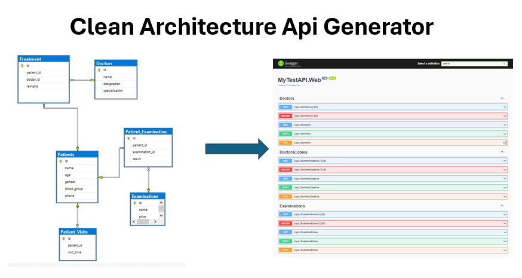

# CA.ApiGenerator PowerShell Module

Generate Clean Architecture API solutions from your existing database with a single command!

> **Built on Jason Taylor's Clean Architecture Template** - This module provides PowerShell automation for [ca-sln](https://github.com/jasontaylordev/CleanArchitecture) to enable database-first solution generation.

## Installation

```powershell
# Step 1: Install Jason Taylor's CA template (required dependency)
dotnet new install Clean.Architecture.Solution.Template

# Step 2: Import this module
Import-Module .\CA.ApiGenerator\CA.ApiGenerator.psd1

# Step 3: Verify installation
Get-Command New-CAApiSolution
ca-sln --version
```

## Quick Start

### Interactive Mode
```powershell
New-CAApiSolution
```

### Automated Mode
```powershell
New-CAApiSolution `
  -ConnectionString "Server=localhost;Database=mydb;Integrated Security=true;" `
  -ProjectName "MyAPI"
```

## Features

- ✅ Generates complete Clean Architecture solution
- ✅ Supports SQL Server, PostgreSQL, SQLite
- ✅ CQRS pattern with MediatR
- ✅ FluentValidation for input validation
- ✅ Entity Framework Core integration
- ✅ REST API controllers auto-generated
- ✅ Integrated code generator for future entities
- ✅ Simple PowerShell interface to ca-sln
- ✅ Automated and interactive modes

## Parameters

- **ConnectionString** - Database connection string (optional, prompts if not provided)
- **ProjectName** - API project name (optional, auto-detected from database)
- **Interactive** - Force interactive prompts even when parameters provided

## Examples

See `Get-Help New-CAApiSolution -Examples` for more usage scenarios.

## Requirements

- PowerShell 5.1 or higher
- .NET SDK 9.0 or higher
- **ca-sln tool** (install via `dotnet tool install -g ca-sln`)
- Access to target database

## Credits

- **Clean Architecture Template** by [Jason Taylor](https://github.com/jasontaylordev)
- **PowerShell Wrapper** - This module adds database automation on top of ca-sln



## License

MIT License - see LICENSE file for details

This module wraps Jason Taylor's Clean Architecture template. Please review both licenses.